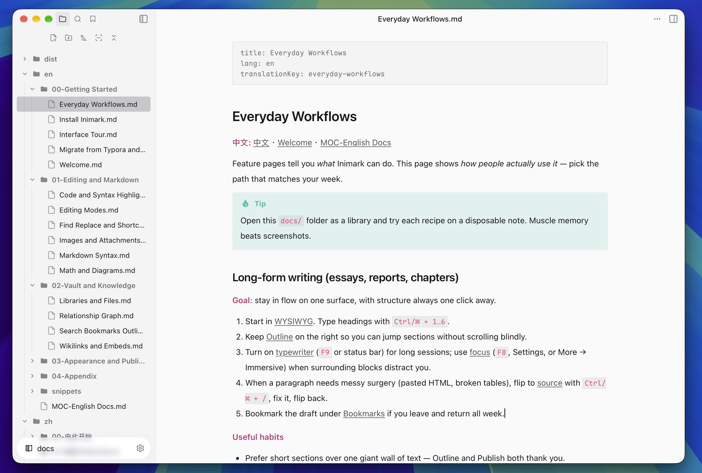
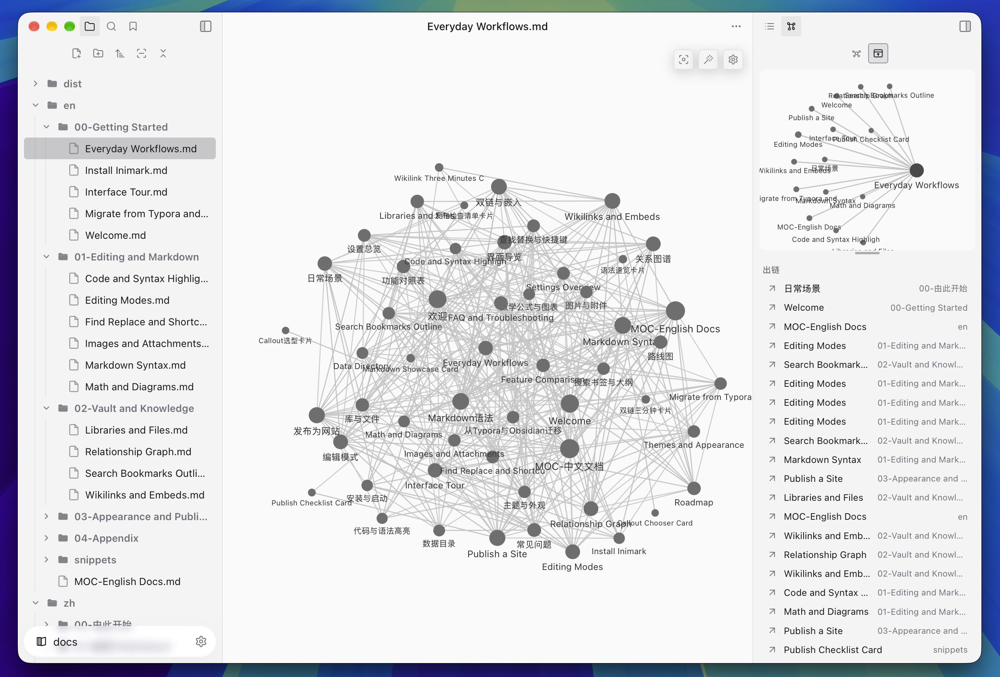
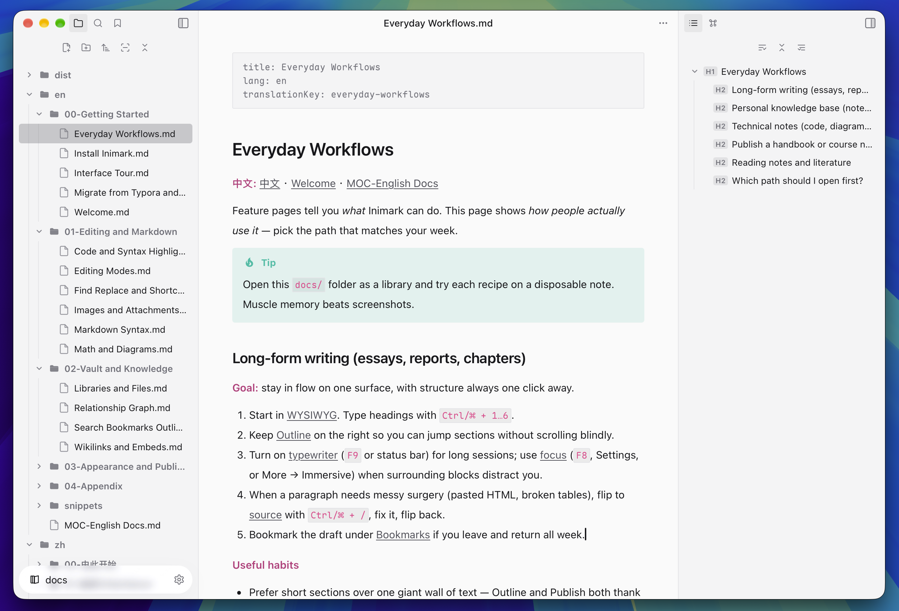
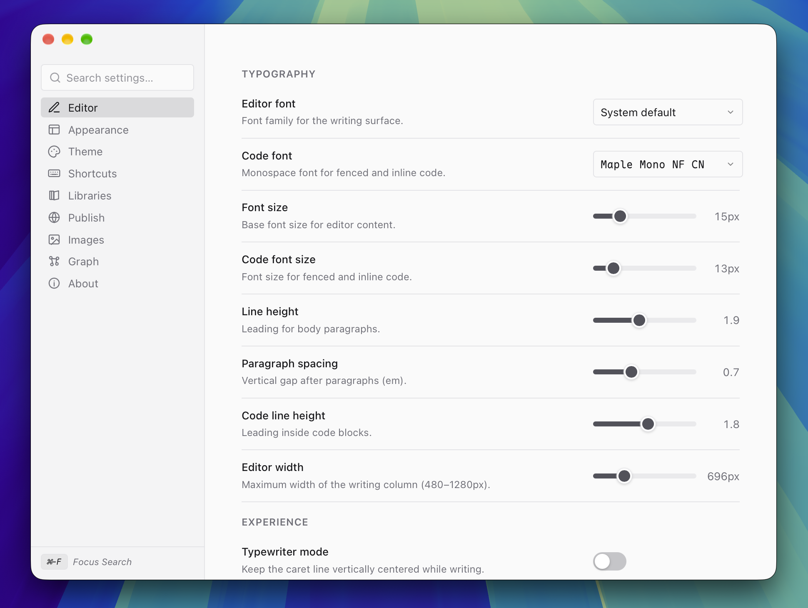

<p align="center">
  
</p>

<h1 align="center">Inimark</h1>

<p align="center">
  <strong>落笔无限</strong><br/>
  一张安静的书桌，留给认真书写 — 编辑体验至上，设计克制留白，思维可以延展
</p>

<p align="center">
  <strong>中文</strong> ·
  <a href="README.md">English</a>
</p>

<p align="center">
  <a href="https://dionysen.github.io/Inimark/"></a>
  <a href="https://dionysen.github.io/Inimark/docs/zh/00-%E7%94%B1%E6%AD%A4%E5%BC%80%E5%A7%8B/%E6%AC%A2%E8%BF%8E.html"></a>
  <a href="https://dionysen.github.io/Inimark/docs/en/00-Getting%20Started/Welcome.html"></a>
  <a href="https://github.com/Dionysen/Inimark/releases"></a>
  
  
</p>

<p align="center">
  <a href="https://dionysen.github.io/Inimark/">主页</a> ·
  <a href="https://github.com/Dionysen/Inimark/releases">下载</a> ·
  <a href="https://dionysen.github.io/Inimark/docs/zh/00-%E7%94%B1%E6%AD%A4%E5%BC%80%E5%A7%8B/%E6%AC%A2%E8%BF%8E.html">文档</a> ·
  <a href="#面向用户">用户指南</a> ·
  <a href="#面向开发者">开发指南</a>
</p>

<p align="center">
  <picture>
    <source media="(prefers-color-scheme: dark)" srcset="docs/assets/note-dark.png" />
    
  </picture>
</p>

---

## 为什么是 Inimark？

多数 Markdown 工具让你二选一：被预览分栏切开的页面，或被功能壳层淹没的知识库。Inimark 从另一端出发 —

**书写面本身，就是产品。**

- **手感先于控件。** 真正的所见即所得，单画布、无左右分栏；需要时一键切到源码，用完再把页面还给安静。
- **设计保持克制。** 墨与纸的黑白灰：排版、留白、浅色 / 深色主题，都为了退到幕后，让文字自己呼吸。
- **思维可以分叉。** 本地库、`[[双链]]`、图谱与大纲 — 结构从书写中长出来，而不是另一张仪表盘。
- **发布不必离开书桌。** 同一批笔记，写完即可变成静态站。

> **编辑如艺。思维成网。发布成页。**

| 重心 | 你感受到的 |
| --- | --- |
| 书写 | 沉浸式所见即所得；代码、公式、Mermaid、Callout、表格不打断心流 |
| 氛围 | 适合打字机节奏的页面；界面退让；主题像白纸或夜灯下的桌面 |
| 结构 | WikiLink、嵌入、反向链接、全局 / 局部图谱 |
| 导航 | 快速打开、搜索、书签、实时大纲 |
| 分享 | 库 → 静态站，适合手册、课程、个人站点 |

---

## 功能速览

<table>
  <tr>
    <td width="50%" valign="top">
      <p><strong>一句话，一张面</strong></p>
      <picture>
        <source media="(prefers-color-scheme: dark)" srcset="docs/assets/note-dark.png" />
        
      </picture>
      <p>落笔之处，即是所见。标记退到幕后；需要源码时再唤出，用完仍归寂静。</p>
    </td>
    <td width="50%" valign="top">
      <p><strong>结构，也可以被看见</strong></p>
      <picture>
        <source media="(prefers-color-scheme: dark)" srcset="docs/assets/graph-dark.png" />
        
      </picture>
      <p><code>[[双向链接]]</code> 随书写生长。图谱不是报表，而是换一种方式看见同一批思绪。</p>
    </td>
  </tr>
  <tr>
    <td width="50%" valign="top">
      <p><strong>长文，仍在手边</strong></p>
      <picture>
        <source media="(prefers-color-scheme: dark)" srcset="docs/assets/outline-dark.png" />
        
      </picture>
      <p>大纲、搜索、书签近在咫尺，却不挤占正文 — 跳转，再回到这一行。</p>
    </td>
    <td width="50%" valign="top">
      <p><strong>氛围，可以微调</strong></p>
      <picture>
        <source media="(prefers-color-scheme: dark)" srcset="docs/assets/setting-dark.png" />
        
      </picture>
      <p>浅色与深色、编辑偏好、发布选项 — 换房间的光，不必打断落笔。</p>
    </td>
  </tr>
</table>

---

## 面向用户

### 安装

从 [Releases](https://github.com/Dionysen/Inimark/releases) 下载对应平台安装包：

| 平台 | 推荐资源 |
| --- | --- |
| macOS | `.dmg` 或 `.app.tar.gz` |
| Windows | `.msi` 或 `.exe`（NSIS） |
| Linux | `.AppImage` / `.deb` / `.rpm` |

> 若系统拦截未签名应用：macOS 在「隐私与安全性」中允许；Windows SmartScreen 选择「仍要运行」（仅在你信任该发布时）。

### 第一次使用（三分钟）

1. 启动 Inimark，**打开文件夹**作为库（也可把文件夹拖进窗口）。
2. 新建笔记，在画布上直接写 — 所见即所得，没有预览分栏。
3. 用 `[[笔记名]]` 链接其他笔记；想看见思维形状时，打开**关系图谱**。
4. 长文时把**大纲 / 搜索 / 书签**放在手边，却不必离开这一页。
5. 草稿可分享时，在设置里使用 **发布**（详见文档 [发布为网站](https://dionysen.github.io/Inimark/docs/zh/03-%E5%A4%96%E8%A7%82%E4%B8%8E%E5%8F%91%E5%B8%83/%E5%8F%91%E5%B8%83%E4%B8%BA%E7%BD%91%E7%AB%99.html)）。

### 用本仓库的帮助库练手

仓库里的 `docs/` 本身就是一份可打开的中英双语帮助库：

1. 在 Inimark 中打开 `docs/` 文件夹。
2. 从「欢迎」或 `MOC-中文文档` 开始阅读。
3. 边读边改，再练习一次 Publish。

完整用户文档：

- 中文：[欢迎使用 Inimark](https://dionysen.github.io/Inimark/docs/zh/00-%E7%94%B1%E6%AD%A4%E5%BC%80%E5%A7%8B/%E6%AC%A2%E8%BF%8E.html)
- English: [Welcome to Inimark](https://dionysen.github.io/Inimark/docs/en/00-Getting%20Started/Welcome.html)
- 产品主页：[dionysen.github.io/Inimark](https://dionysen.github.io/Inimark/)

---

## 面向开发者

### 架构

```
apps/desktop/          Tauri 2 桌面壳 + Vite/TS UI
packages/editor/       @inimark/editor — typora-web 风格 WYSIWYG（ProseMirror）
packages/site-render/  库 → 静态站的 SSG 模型（Publish）
crates/inimark-ssg/    写入 dist / 本地预览等原生 I/O
docs/                  产品帮助库 + 宣传落地页（docs/landing）
```

- **编辑器核心**（`@inimark/editor`）：源自 [Albert-PZY/typora-web](https://github.com/Albert-PZY/typora-web)（MIT）。详见 `NOTICE` 与 `packages/editor/UPSTREAM-LICENSE`。
- **桌面应用**（`@inimark/desktop`）：Tauri 2 + Vite；Rust 侧负责文件、更新、发布写入等原生能力。
- **文档站**：`pnpm docs:build` 构建帮助库；存在 `docs/landing` 时，站点根路径为宣传主页，文档在 `/docs/` 下。

### 环境要求

| 依赖 | 版本建议 |
| --- | --- |
| Node.js | 20+ |
| pnpm | 10+（仓库已锁定 `packageManager`） |
| Rust | stable（跑 `pnpm tauri` / 桌面构建需要） |

### 常用命令

```bash
pnpm install

# 桌面开发（Vite 前端；完整桌面能力请用 tauri）
pnpm dev

# Tauri 桌面调试
pnpm tauri dev

# 测试
pnpm test:editor
pnpm test:desktop
pnpm test

# 类型检查 / 全量构建
pnpm typecheck
pnpm build

# 文档站：构建到 docs/dist；部署现有 dist 到 gh-pages
pnpm docs:build
pnpm docs:deploy
```

### 开发提示

- 改编辑器行为 → `packages/editor`（单元测试与 specs 在同包）。
- 改桌面壳、库管理、发布面板 → `apps/desktop`。
- 改发布 HTML/CSS/路径 → `packages/site-render`；宣传页源文件在 `docs/landing/`。
- 版本号可用 `pnpm bump-version`；图标替换可用 `pnpm replace-icon`。

### 贡献

Issue / PR 欢迎。改动涉及用户可见行为时，请同步更新 `docs/` 中对应说明，并尽量补测试。

---

## License

本仓库以 **MIT** 许可发布。编辑器包内含 typora-web 衍生代码，第三方声明见 [`NOTICE`](NOTICE)。
