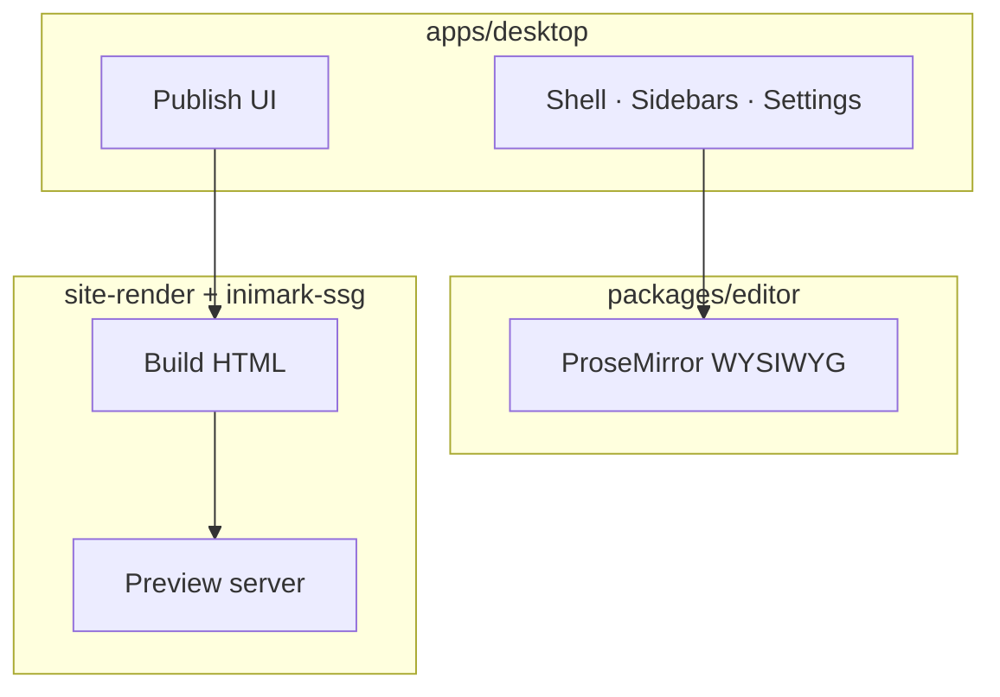

# Install Inimark

**中文:** [[安装与启动|中文]] · Back to [[Welcome]] · [[MOC-English Docs]]

> [!NOTE]
> Inimark is a **Tauri 2** desktop app: Vite + TypeScript UI, editor core in `@inimark/editor`, native I/O in Rust.

## Install from GitHub Releases (recommended)

Download installers from the official release page:

[https://github.com/Dionysen/Inimark/releases](https://github.com/Dionysen/Inimark/releases)

Pick the asset for your platform:

| Platform              | Recommended asset             |
| --------------------- | ----------------------------- |
| macOS (Apple Silicon) | `.dmg` or `.app.tar.gz`       |
| macOS (Intel)         | `.dmg` or `.app.tar.gz`       |
| Windows               | `.msi` or `.exe` (NSIS)       |
| Linux                 | `.AppImage` / `.deb` / `.rpm` |

After install, launch Inimark and open a local vault. In-app updates read `latest.json` from the same release.

> [!TIP]
> Prefer the **Latest** release. If the OS blocks an unsigned download, allow it in system privacy / security settings (macOS: Privacy & Security).

## Open this help vault

1. Launch Inimark
2. **Open folder** and select the repo’s `docs/` directory
3. Start from [[Welcome]] or [[MOC-English Docs]]
4. When ready, open Settings → **Publish** (see [[Publish a Site]])

### Checklist

- [ ] Installed from Releases and launches
- [ ] `docs/` added as a library
- [ ] (Optional) Publish preview opens

## Build from source (contributors)

For development builds you need a local toolchain:

| Dependency | Suggested                            |
| ---------- | ------------------------------------ |
| Node.js    | 20+                                  |
| pnpm       | 10+                                  |
| Rust       | stable (needed for `pnpm tauri dev`) |

```bash
pnpm install

# Editor unit + spec tests
pnpm test:editor

# Desktop integration tests
pnpm test:desktop

# Editor in the browser
pnpm dev

# Tauri desktop
pnpm tauri dev
```

> [!WARNING]
> The first `pnpm tauri dev` compiles Rust crates and can take a while. Install [Tauri prerequisites](https://v2.tauri.app/start/prerequisites/) for your OS.

## Architecture sketch



See also [[Feature Comparison]] and [[Data Directory]].

---

Prev: [[Welcome]] · Next: [[Interface Tour]]