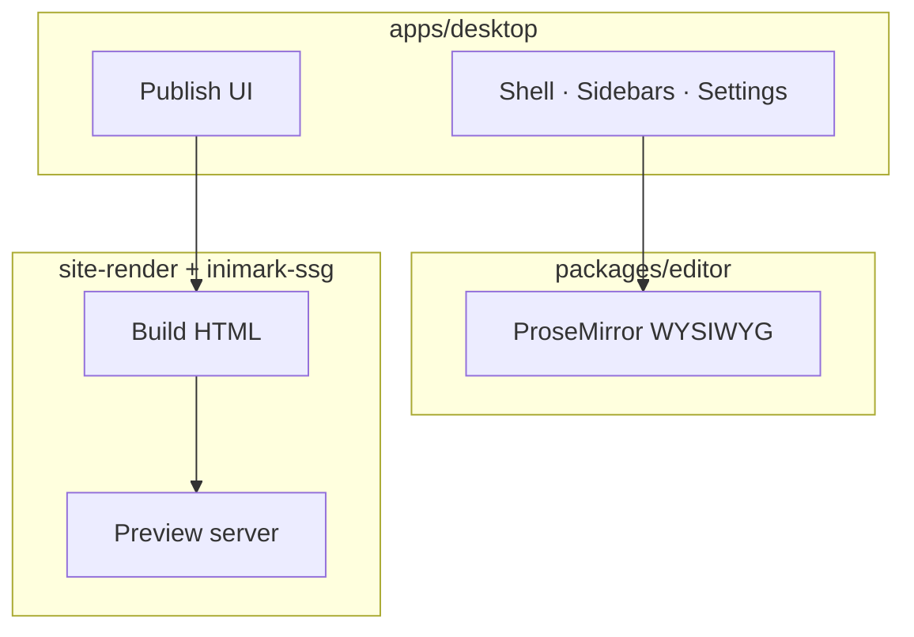

# Install Inimark


**中文:** [[安装与启动|中文]] · Back to [[Welcome]] · [[MOC-English Docs]]

> [!NOTE]
> Inimark is a **Tauri 2** desktop app: Vite + TypeScript UI, editor core in `@inimark/editor`, native I/O in Rust.

## Prerequisites

| Dependency | Suggested |
| --- | --- |
| Node.js | 20+ |
| pnpm | 10+ |
| Rust | stable (needed for `pnpm tauri dev`) |

## Common commands

```bash
pnpm install

# Editor unit + spec tests
pnpm test:editor

# Desktop integration tests
pnpm test:desktop

# Editor in the browser
pnpm dev

# Tauri desktop
pnpm tauri dev
```

> [!WARNING]
> The first `pnpm tauri dev` compiles Rust crates and can take a while. Install [Tauri prerequisites](https://v2.tauri.app/start/prerequisites/) for your OS.

## Open this help vault

1. Launch Inimark
2. **Open folder** and select the repo’s `docs/` directory
3. Start from [[Welcome]] or [[MOC-English Docs]]
4. When ready, open Settings → **Publish** (see [[Publish a Site]])

### Checklist

- [ ] Node / pnpm / Rust ready
- [ ] `pnpm install` succeeded
- [ ] `pnpm tauri dev` opens a window
- [ ] `docs/` added as a library

## Architecture sketch



See also [[Feature Comparison]] and [[Data Directory]].

---

Prev: [[Welcome]] · Next: [[Interface Tour]]
