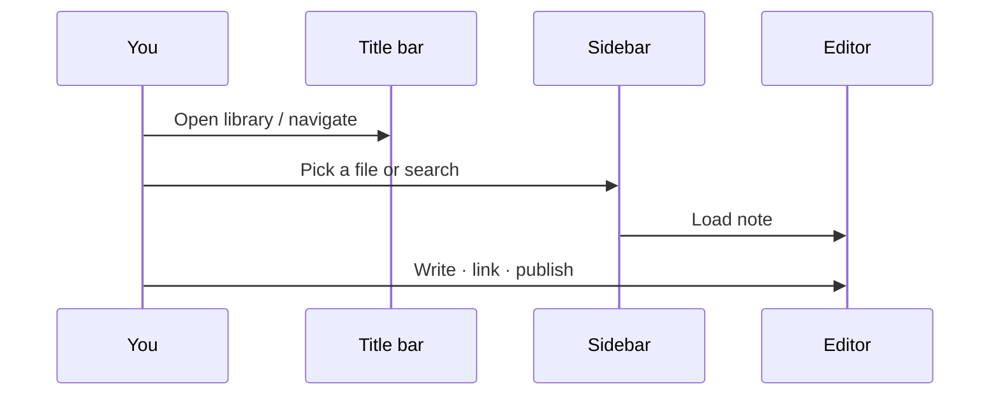

# Interface Tour

[toc]

**中文:** [[界面导览|中文]] · [[MOC-English Docs]]

Think of the main window as three columns:

```text
┌──────────┬─────────────────────┬──────────┐
│ Left     │     Editor          │  Right   │
│ Files…   │  WYSIWYG / Source   │ Outline… │
└──────────┴─────────────────────┴──────────┘
               Status / Title bar
```

## Title bar

| Area | Role |
| --- | --- |
| Back / Forward | [[Libraries and Files|Navigation history]] across opened notes |
| Window controls | Min / max / close (macOS traffic lights) |
| More menu | Immersive options: auto-hide title / status bar |

> [!TIP]
> For distraction-free writing, auto-hide the title and status bars so the UI feels closer to “a single sheet of paper”. See [[Themes and Appearance]].

## Dual sidebars

Left and right **tabs are configurable** (Files / Search / Bookmarks / Outline / Graph).

| Tab | One-liner | Deep dive |
| --- | --- | --- |
| Files | Vault file tree | [[Libraries and Files]] |
| Search | Name + content search | [[Search Bookmarks Outline]] |
| Bookmarks | Bookmarks and groups | [[Search Bookmarks Outline]] |
| Outline | Heading tree for the active note | [[Search Bookmarks Outline]] |
| Graph | Graph plus outlinks / backlinks | [[Relationship Graph]] |

Sidebars support:

- **Collapse / expand**
- **Drag to resize**
- **Tab placement** (left vs right) in settings

## Editor host

The center is `@inimark/editor`:

- Default [[Editing Modes#WYSIWYG|WYSIWYG]]
- `Ctrl/⌘ + /` toggles [[Editing Modes#Source mode|source mode]]
- Optional [[Editing Modes#Typewriter mode|typewriter mode]]

Context menus insert formatting, links, callouts — see [[Markdown Syntax]].

## Status bar

Typical items:

- Word / character counts
- Typewriter toggle
- Scroll to top / bottom
- Other edit state (depending on config)

## Settings window

Settings open in a **separate window** and are searchable. See [[Settings Overview]]:

Editor · Appearance · Theme · Shortcuts · Libraries · Publish · Images · Graph · About

---



Prev: [[Install Inimark]] · Next: [[Editing Modes]]
