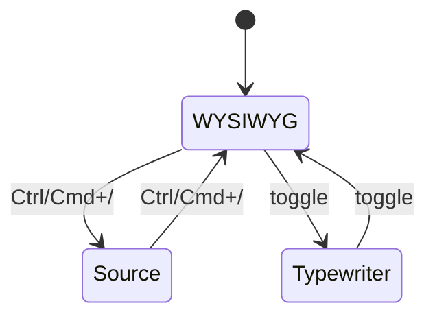

# Editing Modes

[toc]

**中文:** [[编辑模式|中文]] · [[MOC-English Docs]]

Inimark’s editing idea is simple:

> **One surface, two depths** — by default you read a typeset page; when needed, Markdown source appears.

## WYSIWYG

Default mode (Typora-style):

- The active line / span shows markup (`**`, `#`, `[[`…)
- When the caret leaves, marks hide and only formatting remains
- There is **no** split-pane “live preview” — the preview *is* the editor

> [!TIP]
> Coming from classic left-MD / right-HTML editors? Spend a day in WYSIWYG only. Most people enter flow faster. See [[Feature Comparison]].

Example:

> A quote with **emphasis** and ==highlight==.
>
> Or a callout:

> [!NOTE]
> Callouts are covered in [[Markdown Syntax#Callouts|Markdown Syntax]].

## Source mode

Shortcut: `Ctrl + /` (macOS: `⌘ + /`)

| Trait | Detail |
| --- | --- |
| Engine | CodeMirror |
| Line numbers | Yes |
| Best for | Structural edits, messy pastes, debugging markup |

Switching back re-folds the document into the typeset view.

## Typewriter mode

Keeps the **current line near vertical center** to reduce vertical eye travel — great for long notes.

- Enable under **Settings → Editor**
- Or toggle from the **status bar** (see [[Interface Tour]])

## Focus mode (API ready, UI pending)

The editor core exposes Focus Mode (dims inactive blocks). The desktop shell does **not** yet wire a shortcut or setting.

> [!WARNING]
> Docs only claim **wired** features. For Focus Mode status, see [[Roadmap]].

## Mode matrix

| Mode | Maturity | Entry |
| --- | --- | --- |
| WYSIWYG | ✅ | Default |
| Source | ✅ | `Ctrl/⌘+/` |
| Typewriter | ✅ | Settings / status bar |
| Focus | 🟡 API | [[Roadmap]] |

Related: [[Markdown Syntax]] · [[Find Replace and Shortcuts]] · [[Math and Diagrams]]
