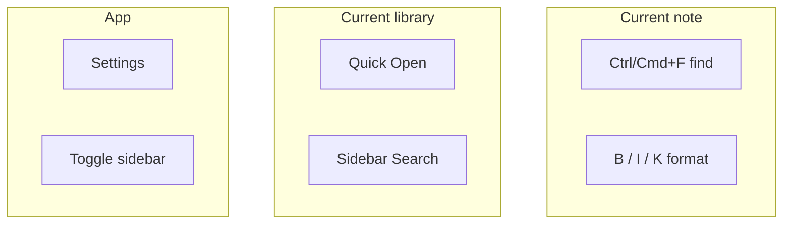

# Find, Replace, and Shortcuts

**中文:** [[查找替换与快捷键|中文]] · [[Editing Modes]] · [[Settings Overview]]

## Find and replace

| Action | Windows / Linux | macOS |
| --- | --- | --- |
| Find | `Ctrl + F` | `⌘ + F` |
| Replace | `Ctrl + H` | `⌘ + H` |

Find bar supports:

- [x] Match case
- [x] Whole word
- [x] Regular expressions

> [!TIP]
> Vault-wide search lives in the **Search** tab — see [[Search Bookmarks Outline]]. `Ctrl+F` is **in-document** only.

## Editor shortcuts (common)

| Action | Windows / Linux | macOS |
| --- | --- | --- |
| Bold | `Ctrl + B` | `⌘ + B` |
| Italic | `Ctrl + I` | `⌘ + I` |
| Underline | `Ctrl + U` | `⌘ + U` |
| Link | `Ctrl + K` | `⌘ + K` |
| Heading 1–6 | `Ctrl + 1…6` | `⌘ + 1…6` |
| Paragraph | `Ctrl + 0` | `⌘ + 0` |
| Source mode | `Ctrl + /` | `⌘ + /` |
| Paste plain | `Ctrl + Shift + V` | `⌘ + Shift + V` |
| Hard break | `Shift + Enter` | `Shift + Enter` |

Lists, quotes, code, and math also use `Alt + Ctrl/⌘` chords — check **Settings → Shortcuts** and editor defaults.

## App shortcuts (rebindable)

Under **Settings → Shortcuts**:

| Group | Examples |
| --- | --- |
| File | Save, Save As, New, Close |
| Open | Quick Open (often bound as Open) |
| View | Toggle sidebar, search in files |
| Explorer | Rename, delete, cut / copy / paste |
| App | Open settings |

> [!NOTE]
> “Open” in Inimark is often **Quick Open** (fuzzy note picker), not the OS file dialog. See [[Libraries and Files]].

## Font zoom

`Ctrl/⌘ + mouse wheel` zooms editor font size — handy for long reads.

## Mental model

Rebind keys → [[Settings Overview]] · Learn markup → [[Markdown Syntax]].
