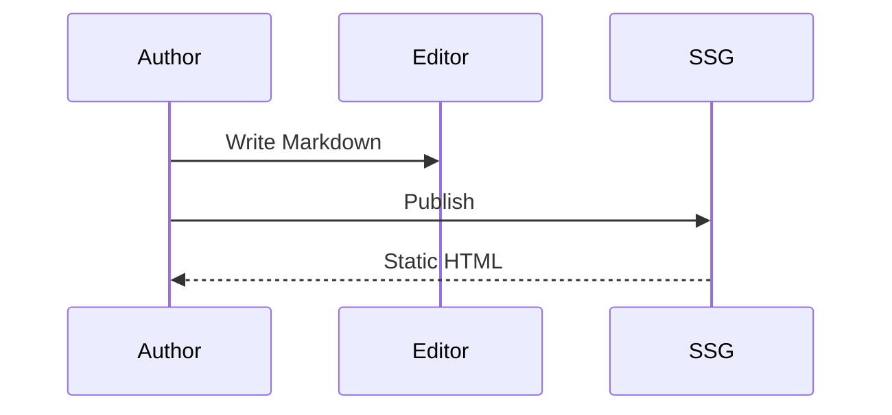
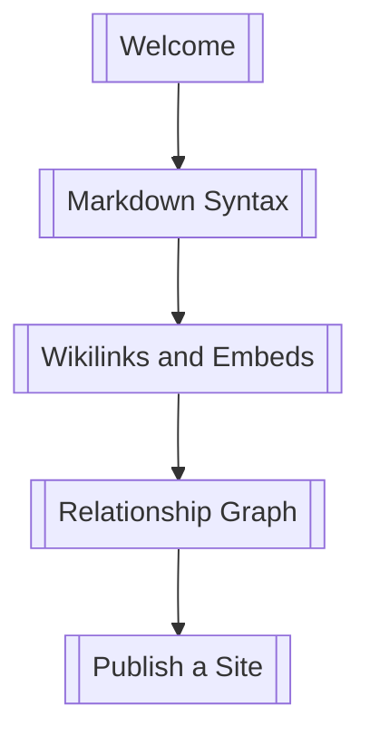

# Math and Diagrams


**中文:** [[数学公式与图表|中文]] · [[Markdown Syntax]] · [[MOC-English Docs]]

Inimark ships **KaTeX** and **Mermaid**, with familiar academic / engineering markup.

## Inline math

Mass–energy: $E = mc^2$

Pythagoras: $a^2 + b^2 = c^2$

Markup:

```markdown
$E = mc^2$
```

## Block math

Bayes’ theorem:

$$
P(A\mid B) = \frac{P(B\mid A)\,P(A)}{P(B)}
$$

Matrix:

$$
\begin{pmatrix}
a & b \\
c & d
\end{pmatrix}
\begin{pmatrix}
x \\
y
\end{pmatrix}
=
\begin{pmatrix}
ax + by \\
cx + dy
\end{pmatrix}
$$

> [!TIP]
> Tweak large formulas in [[Editing Modes#Source mode|source mode]], then return to WYSIWYG.

## Mermaid flowchart

```mermaid
flowchart LR
  Note[Note] -->|[[wikilink]]| Note2[Another note]
  Note2 --> Graph[Graph]
  Note --> Site[Published site]
```

## Mermaid sequence



## Reading path sketch



> [!NOTE]
> Other Mermaid diagram types depend on the bundled Mermaid build. Prefer common kinds like `flowchart` and `sequenceDiagram`.

## Publishing

Publish packs KaTeX assets so formulas survive on the static site. See [[Publish a Site]] and [[Themes and Appearance]].

---

Prev: [[Markdown Syntax]] · Next: [[Find Replace and Shortcuts]]
