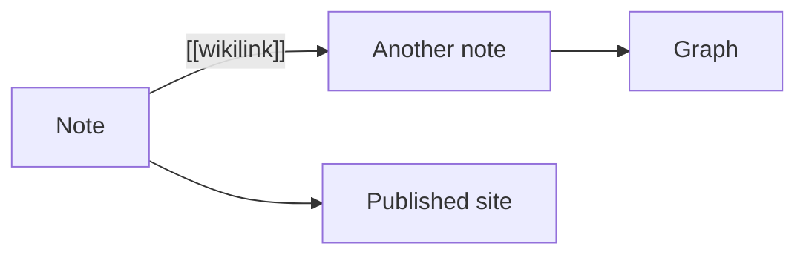
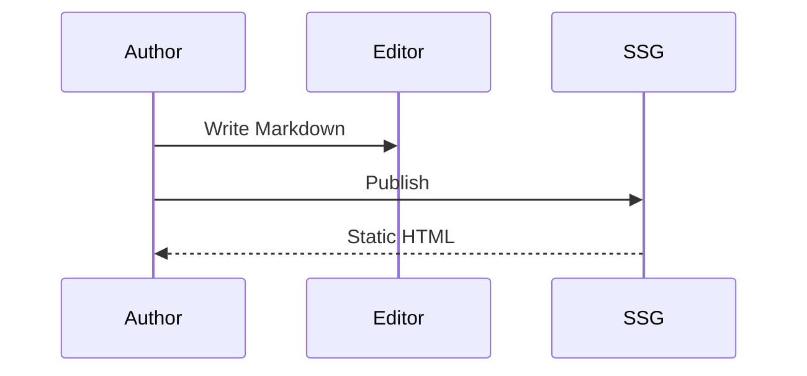
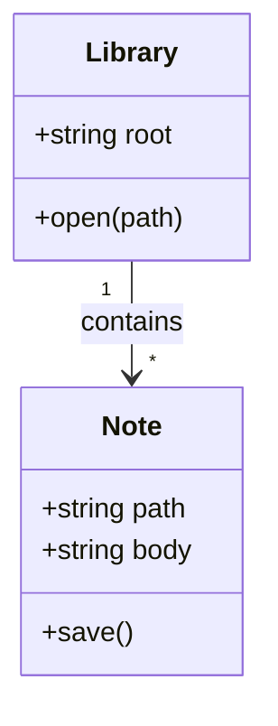
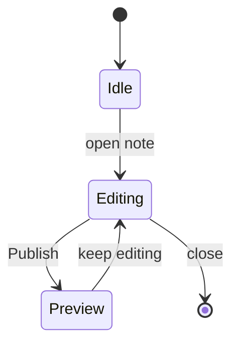
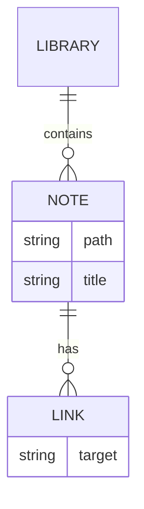
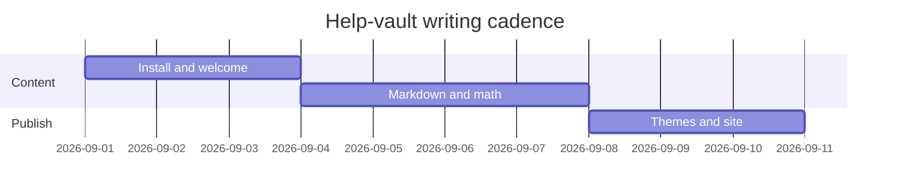
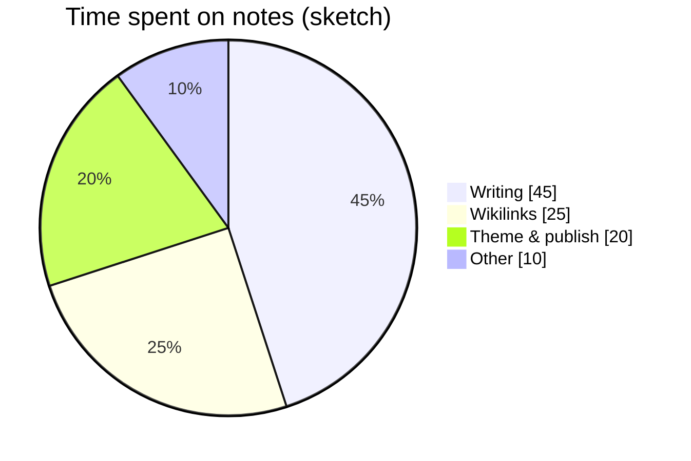
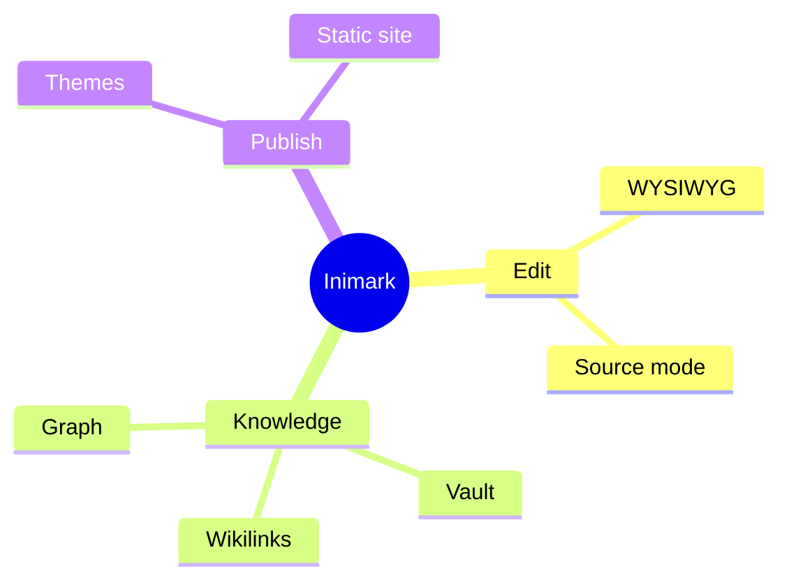
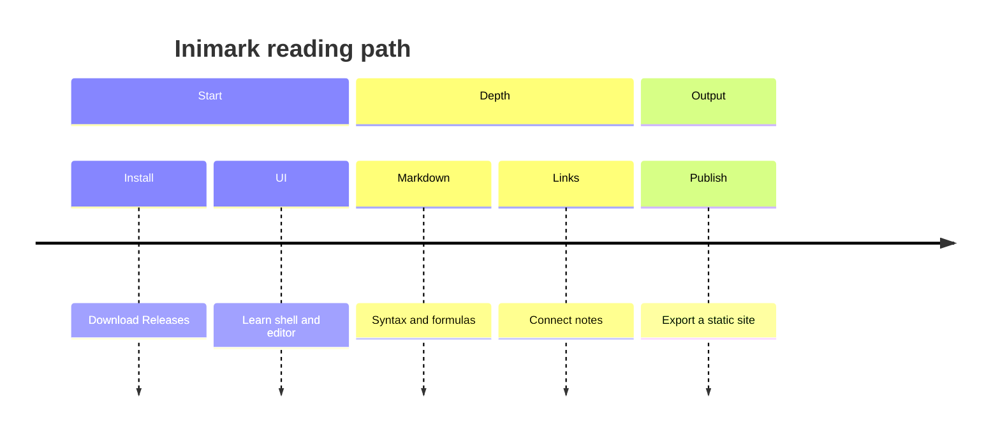
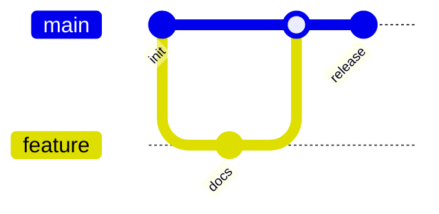

# Math and Diagrams

**中文:** [[数学公式与图表|中文]] · [[Markdown Syntax]] · [[MOC-English Docs]]

Inimark ships **KaTeX** and **Mermaid**, with familiar academic / engineering markup. Each example below shows **source first, then the rendered result**.

## Inline math

Source:

```markdown
Mass–energy: $E = mc^2$

Euler’s identity: $e^{i\pi} + 1 = 0$

Pythagoras: $a^2 + b^2 = c^2$
```

Rendered:

Mass–energy: $E = mc^2$

Euler’s identity: $e^{i\\pi} + 1 = 0$

Pythagoras: $a^2 + b^2 = c^2$

## Block math

### Bayes’ theorem

Source:

```markdown
$$
P(A\mid B) = \frac{P(B\mid A)\,P(A)}{P(B)}
$$
```

Rendered:

$$
P(A\mid B) = \frac{P(B\mid A)\,P(A)}{P(B)}
$$

### Matrix product

Source:

```markdown
$$
\begin{pmatrix}
a & b \\
c & d
\end{pmatrix}
\begin{pmatrix}
x \\
y
\end{pmatrix}
=
\begin{pmatrix}
ax + by \\
cx + dy
\end{pmatrix}
$$
```

Rendered:

$$
\begin{pmatrix}
a & b \\
c & d
\end{pmatrix}
\begin{pmatrix}
x \\
y
\end{pmatrix}
=
\begin{pmatrix}
ax + by \\
cx + dy
\end{pmatrix}
$$

### Gaussian integral

Source:

```markdown
$$
\int_{-\infty}^{\infty} e^{-x^{2}}\,dx = \sqrt{\pi}
$$
```

Rendered:

$$
\int_{-\infty}^{\infty} e^{-x^{2}}\,dx = \sqrt{\pi}
$$

### Taylor series (exponential)

Source:

```markdown
$$
e^{x} = \sum_{n=0}^{\infty} \frac{x^{n}}{n!} = 1 + x + \frac{x^{2}}{2!} + \frac{x^{3}}{3!} + \cdots
$$
```

Rendered:

$$
e^{x} = \sum_{n=0}^{\infty} \frac{x^{n}}{n!} = 1 + x + \frac{x^{2}}{2!} + \frac{x^{3}}{3!} + \cdots
$$

### Fourier transform

Source:

```markdown
$$
\hat{f}(\xi) = \int_{-\infty}^{\infty} f(x)\,e^{-2\pi i x\xi}\,dx
$$
```

Rendered:

$$
\hat{f}(\xi) = \int_{-\infty}^{\infty} f(x)\,e^{-2\pi i x\xi}\,dx
$$

### Time-dependent Schrödinger equation

Source:

```markdown
$$
i\hbar\frac{\partial}{\partial t}\Psi(\mathbf{r}, t) = \hat{H}\Psi(\mathbf{r}, t)
$$
```

Rendered:

$$
i\hbar\frac{\partial}{\partial t}\Psi(\mathbf{r}, t) = \hat{H}\Psi(\mathbf{r}, t)
$$

### Maxwell’s equations

Source:

```markdown
$$
\begin{aligned}
\nabla\cdot\mathbf{E} &= \frac{\rho}{\varepsilon_{0}} \\
\nabla\cdot\mathbf{B} &= 0 \\
\nabla\times\mathbf{E} &= -\frac{\partial\mathbf{B}}{\partial t} \\
\nabla\times\mathbf{B} &= \mu_{0}\mathbf{J} + \mu_{0}\varepsilon_{0}\frac{\partial\mathbf{E}}{\partial t}
\end{aligned}
$$
```

Rendered:

$$
\begin{aligned}
\nabla\cdot\mathbf{E} &= \frac{\rho}{\varepsilon_{0}} \\
\nabla\cdot\mathbf{B} &= 0 \\
\nabla\times\mathbf{E} &= -\frac{\partial\mathbf{B}}{\partial t} \\
\nabla\times\mathbf{B} &= \mu_{0}\mathbf{J} + \mu_{0}\varepsilon_{0}\frac{\partial\mathbf{E}}{\partial t}
\end{aligned}
$$

### Euler–Lagrange equation

Source:

```markdown
$$
\frac{d}{dt}\left(\frac{\partial L}{\partial \dot{q}_{i}}\right) - \frac{\partial L}{\partial q_{i}} = 0
$$
```

Rendered:

$$
\frac{d}{dt}\left(\frac{\partial L}{\partial \dot{q}_{i}}\right) - \frac{\partial L}{\partial q_{i}} = 0
$$

### Einstein field equations

Source:

```markdown
$$
R_{\mu\nu} - \frac{1}{2}Rg_{\mu\nu} + \Lambda g_{\mu\nu} = \frac{8\pi G}{c^{4}}T_{\mu\nu}
$$
```

Rendered:

$$
R_{\mu\nu} - \frac{1}{2}Rg_{\mu\nu} + \Lambda g_{\mu\nu} = \frac{8\pi G}{c^{4}}T_{\mu\nu}
$$

### Incompressible Navier–Stokes

Source:

```markdown
$$
\rho\left(\frac{\partial\mathbf{u}}{\partial t} + \mathbf{u}\cdot\nabla\mathbf{u}\right) = -\nabla p + \mu\nabla^{2}\mathbf{u} + \mathbf{f}
$$
```

Rendered:

$$
\rho\left(\frac{\partial\mathbf{u}}{\partial t} + \mathbf{u}\cdot\nabla\mathbf{u}\right) = -\nabla p + \mu\nabla^{2}\mathbf{u} + \mathbf{f}
$$

### Cauchy’s integral formula

Source:

```markdown
$$
f(a) = \frac{1}{2\pi i}\oint_{C}\frac{f(z)}{z-a}\,dz
$$
```

Rendered:

$$
f(a) = \frac{1}{2\pi i}\oint_{C}\frac{f(z)}{z-a}\,dz
$$

### Black–Scholes PDE

Source:

```markdown
$$
\frac{\partial V}{\partial t} + \frac{1}{2}\sigma^{2}S^{2}\frac{\partial^{2}V}{\partial S^{2}} + rS\frac{\partial V}{\partial S} - rV = 0
$$
```

Rendered:

$$
\frac{\partial V}{\partial t} + \frac{1}{2}\sigma^{2}S^{2}\frac{\partial^{2}V}{\partial S^{2}} + rS\frac{\partial V}{\partial S} - rV = 0
$$

> [!TIP]
> Tweak large formulas in [[Editing Modes#Source mode|source mode]], then return to WYSIWYG.

## Mermaid diagram gallery

Each diagram shows copyable source first, then the rendered chart. Put the source in a ````mermaid` fence.

### Flowchart

Source:

```markdown

```

Rendered:


### Sequence diagram

Source:

```markdown

```

Rendered:


### Class diagram

Source:

```markdown

```

Rendered:


### State diagram

Source:

```markdown

```

Rendered:


### Entity-relationship diagram

Source:

```markdown

```

Rendered:


### Gantt chart

Source:

```markdown

```

Rendered:


### Pie chart

Source:

```markdown

```

Rendered:


### Mind map

Source:

```markdown

```

Rendered:


### Timeline

Source:

```markdown

```

Rendered:


### Git graph

Source:

```markdown

```

Rendered:


### User journey

Source:

```markdown
```mermaid
journey
  title From install to publish
  section Install
    Open Releases: 5: User
    Install app: 4: User
  section Write
    Open docs vault: 5: User
    Edit notes: 5: User
  section Publish
    Publish preview: 4: User
```
```

Rendered:

```mermaid
journey
  title From install to publish
  section Install
    Open Releases: 5: User
    Install app: 4: User
  section Write
    Open docs vault: 5: User
    Edit notes: 5: User
  section Publish
    Publish preview: 4: User
```

### Quadrant chart

Source:

```markdown
```mermaid
quadrantChart
  title Feature trade-offs (sketch)
  x-axis Low effort --> High effort
  y-axis Low value --> High value
  quadrant-1 Do first
  quadrant-2 Evaluate
  quadrant-3 Deprioritize
  quadrant-4 Be careful
  WYSIWYG: [0.7, 0.85]
  Wikilink graph: [0.65, 0.8]
  Publish: [0.55, 0.75]
  Plugin market: [0.9, 0.35]
```
```

Rendered:

```mermaid
quadrantChart
  title Feature trade-offs (sketch)
  x-axis Low effort --> High effort
  y-axis Low value --> High value
  quadrant-1 Do first
  quadrant-2 Evaluate
  quadrant-3 Deprioritize
  quadrant-4 Be careful
  WYSIWYG: [0.7, 0.85]
  Wikilink graph: [0.65, 0.8]
  Publish: [0.55, 0.75]
  Plugin market: [0.9, 0.35]
```

### Requirement diagram

Source:

```markdown
```mermaid
requirementDiagram
  requirement stable {
    id: R1
    text: Math and diagrams render in WYSIWYG
    risk: low
    verifymethod: test
  }
  element editor {
    type: component
  }
  editor - satisfies -> stable
```
```

Rendered:

```mermaid
requirementDiagram
  requirement stable {
    id: R1
    text: Math and diagrams render in WYSIWYG
    risk: low
    verifymethod: test
  }
  element editor {
    type: component
  }
  editor - satisfies -> stable
```

> [!NOTE]
> Newer Mermaid kinds (e.g. `sankey`, `xychart`, `block`) depend on the bundled Mermaid build. The gallery above sticks to common, stable types.

## Publishing

Publish packs KaTeX assets so formulas survive on the static site. See [[Publish a Site]] and [[Themes and Appearance]].

---

Prev: [[Markdown Syntax]] · Next: [[Find Replace and Shortcuts]]