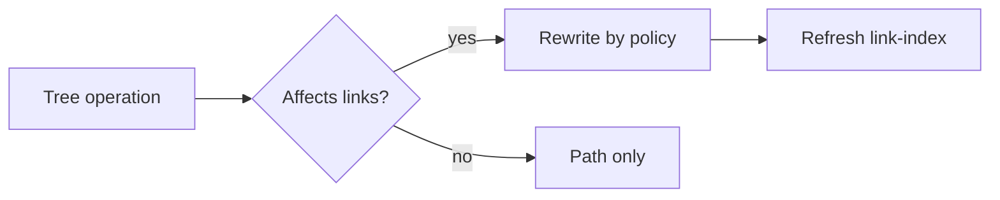

# Libraries and Files

**中文:** [[库与文件|中文]] · [[Wikilinks and Embeds]] · [[MOC-English Docs]]

## What is a library?

A library ≈ an Obsidian vault: a **local folder** of Markdown (and assets).

Inimark supports **multiple libraries** (Settings → Libraries).

> [!IMPORTANT]
> This help site’s source *is* the repo’s `docs/` folder — open it as a library.

## File tree (Files)

In the Files tab you can:

| Action | Notes |
| --- | --- |
| Create | Notes / folders |
| Rename | May trigger link rewrite |
| Delete | Confirmed |
| Move | Drag or cut / paste |
| Reveal | Show the active file in the tree |
| Sort | By name and related rules |

**Drag-and-drop** reorganization is supported.

## Quick Open

Fuzzy name match + recent files — the everyday jumper.

Often bound to the “Open” shortcut (rebind under Shortcuts) → [[Find Replace and Shortcuts]].

## Navigation history

Title-bar **back / forward** moves through visited notes, browser-style — see [[Interface Tour]].

## Session memory

Each library stores view state (caret, scroll, source mode, …) under files like `.inimark/session.json` — see [[Data Directory]].

## Rename and move

When a linked note is renamed or moved, Inimark can:

| Policy | Behavior |
| --- | --- |
| ask | Prompt each time |
| always | Always rewrite |
| never | Never rewrite |

Details: [[Wikilinks and Embeds#Rename and rewrite]].

Next: connect files into a graph → [[Wikilinks and Embeds]].
