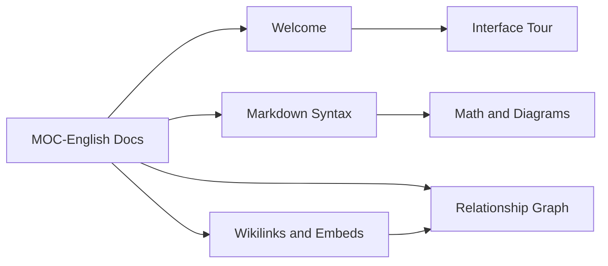

# Relationship Graph

[toc]

**中文:** [[关系图谱|中文]] · [[Wikilinks and Embeds]] · [[MOC-English Docs]]

The graph turns `[[wikilinks]]` into a space you can roam — nodes are notes, edges are links.

## Views

| Mode | Meaning |
| --- | --- |
| Local | Neighborhood around the active note |
| Vault / global | Wider library graph |

Force layout spreads nodes to reduce overlap.

## Panel capabilities (overview)

- Outlink / backlink **lists**
- Fit-to-view
- Timelapse / roam-style interactions (trust the Graph panel in your build)
- Editor linkage (open a note from a node)

> [!TIP]
> Densify links in this help vault: connect [[MOC-English Docs]] to chapters, then open Graph — you’ll see the “docs site” as a shape in space.

## Sketch of this vault

## Settings

**Settings → Graph** holds graph preferences (exact controls vary by version).

## Boundaries

| Present | Absent (for now) |
| --- | --- |
| Note graph | Tag graph |
| Out / back links | Canvas editor |
| Force layout | Dataview-like queries |

See [[Roadmap]] and [[Feature Comparison]].

---

Prev: [[Search Bookmarks Outline]] · Next: [[Themes and Appearance]]
