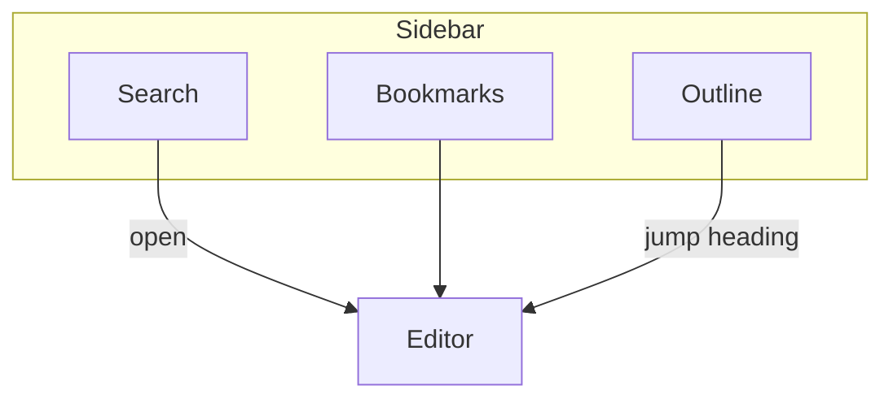

# Search, Bookmarks, and Outline

**中文:** [[搜索书签与大纲|中文]] · [[Interface Tour]] · [[Libraries and Files]]

Three navigation tabs that complement the [[Relationship Graph]].

## Search

| Capability | Notes |
| --- | --- |
| File names | Fast filtering |
| Content | Full-text hits |
| Jump | Open files; may reveal matches in the editor |

> [!NOTE]
> Unlike in-note `Ctrl+F`: Search = **across files**; Find = **current file**. See [[Find Replace and Shortcuts]].

## Bookmarks

Pin frequent notes and organize them in **groups**.

The model focuses on **files** (folder bookmarks were dropped).

Typical uses:

- This week’s “main thread”
- The help MOC [[MOC-English Docs]]
- Pre-publish review notes

- [ ] Bookmark [[Publish a Site]]
- [ ] Bookmark [[Markdown Syntax]]

## Outline

A tree of `AT` headings for the active note; click to jump.

Good for:

- Long-form structure
- Long notes where you want heading jump links without leaving the sidebar

Tab placement is configurable → [[Settings Overview]] · [[Interface Tour]].

---

Next: [[Relationship Graph]]
