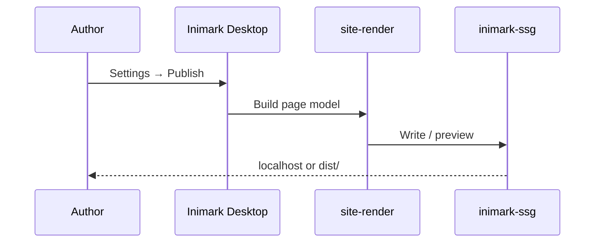

# Publish a Site


**中文:** [[发布为网站|中文]] · [[Themes and Appearance]] · [[MOC-English Docs]]

Build the current library into a **static site**: same Markdown, same theme language, folder tree as navigation.

> [!IMPORTANT]
> This `docs/` help vault is meant for Publish. Config file: `publish.config.json`.

## What you get

| Capability | Status |
| --- | --- |
| Multi-page HTML | ✅ |
| Folder nav tree | ✅ |
| Per-page outline | ✅ |
| Theme switching | ✅ |
| `[[wikilinks]]` → relative hrefs | ✅ |
| Local preview server | ✅ |
| Site-wide search | ❌ (extend later) |
| Graph page | ❌ (extend later) |

Boundaries also live in [[Roadmap]].

## Config fields

| Field | Meaning | This vault |
| --- | --- | --- |
| `siteName` | Site title | `Inimark Docs` |
| `siteDescription` | Meta description | see config |
| `defaultTheme` | Initial theme | `light` |
| `baseHref` | Deploy prefix | `/` or `/repo/` |
| `out` | Output dir | `dist` |
| `home` | Home note | `README.md` |

## Steps

### CLI (recommended for GitHub Pages)

This repo ships a script that builds `docs/` and pushes to `gh-pages`:

```bash
# Build only → docs/dist
pnpm docs:build

# Build and force-push to origin/gh-pages
pnpm docs:deploy
```

Site URL: https://dionysen.github.io/Inimark/  
`publish.config.json` sets `baseHref` to `/Inimark/`.

> [!TIP]
> After the first deploy, set GitHub **Settings → Pages** → Source: **Deploy from a branch** → `gh-pages` / root.

### In-app Publish

1. Open `docs/` as a library in Inimark
2. Open **Settings → Publish**
3. Confirm `siteName` / `out` / `baseHref` / `home`
4. **Preview** locally, or build
5. Deploy `dist/` to any static host



## Authoring conventions

- Number folders for nav order (`00-`, `01-`, …)
- Keep **unique titles** for clean `[[wikilinks]]`
- Parallel trees: `zh/` and `en/`, cross-link with aliases
- Lean on clear headings, callouts, and tables — see [[Markdown Syntax]]
- Use [[README]] as the language portal

## Extending Publish later

When you need search, SEO, or versioning, either:

1. **Grow Inimark Publish** (dogfood), or
2. Sync the same Markdown to a dedicated docs framework

Current strategy: **Publish first**, extend when needed.

---

Related: [[Settings Overview]] · [[Data Directory]] · [[Feature Comparison]]
