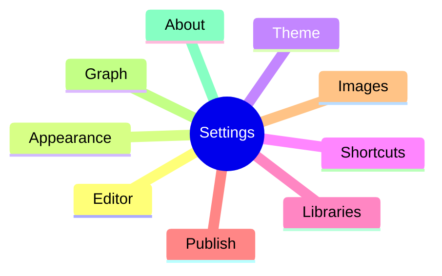

# Settings Overview

[toc]

**中文:** [[设置总览|中文]] · [[Interface Tour]] · [[Find Replace and Shortcuts]]

The settings window is **searchable**. Quick map:

| Section | What you tweak | Docs |
| --- | --- | --- |
| Editor | Typewriter, autosave, format-on-save… | [[Editing Modes]] |
| Appearance | Light/dark, immersive chrome | [[Themes and Appearance]] |
| Theme | Import/export packs, code themes | [[Themes and Appearance]] |
| Shortcuts | Rebind keys | [[Find Replace and Shortcuts]] |
| Libraries | Multi-library, link rewrite | [[Libraries and Files]] · [[Wikilinks and Embeds]] |
| Publish | Site name, output, preview | [[Publish a Site]] |
| Images | Storage mode / assets (partially wired) | [[Roadmap]] |
| Graph | Graph prefs | [[Relationship Graph]] |
| About | Version, updates | — |
| Dev | Developer tools (not end-user) | — |

> [!WARNING]
> The **Images** UI may be ahead of a full paste-to-disk pipeline. Trust runtime behavior; gaps are listed in [[Roadmap]].

## Autosave and formatting

- Autosave with configurable delay
- Format-on-save: CJK spacing, trim, final newline, collapse blank lines, …

Keeps long-lived libraries tidy and [[Publish a Site]] output more stable.

## i18n

App UI supports `en` / `zh-CN` (or system). **Help notes** are a parallel bilingual tree, independent of UI locale — see [[README]].

