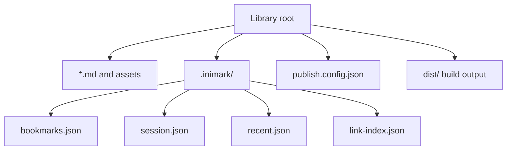

# Data Directory

[toc]

**中文:** [[数据目录|中文]] · [[Libraries and Files]] · [[Publish a Site]]

## App-level (approximate)

| Store | Contents |
| --- | --- |
| `localStorage` | App settings, shortcuts, library list, … |

> Exact keys vary by version; prefer the Settings UI over hand-editing storage.

## Per-library: `.inimark/`

Under each library root:

| File | Role |
| --- | --- |
| `bookmarks.json` | Bookmarks and groups |
| `session.json` | Session: open files, caret/scroll, source mode, … |
| `recent.json` | Recents |
| `link-index.json` | Wikilink index cache |

> [!DANGER]
> `link-index.json` can be rebuilt by the app. **Do not** treat it as a hand-written database.

## Extra files in this help vault

| Path | Role |
| --- | --- |
| `publish.config.json` | Publish config |
| `README.md` | Bilingual portal |
| `zh/` · `en/` | Parallel doc trees |
| `dist/` | Build output (usually ignored via global `dist/`) |

Related: [[Publish a Site]] · [[Wikilinks and Embeds]]
