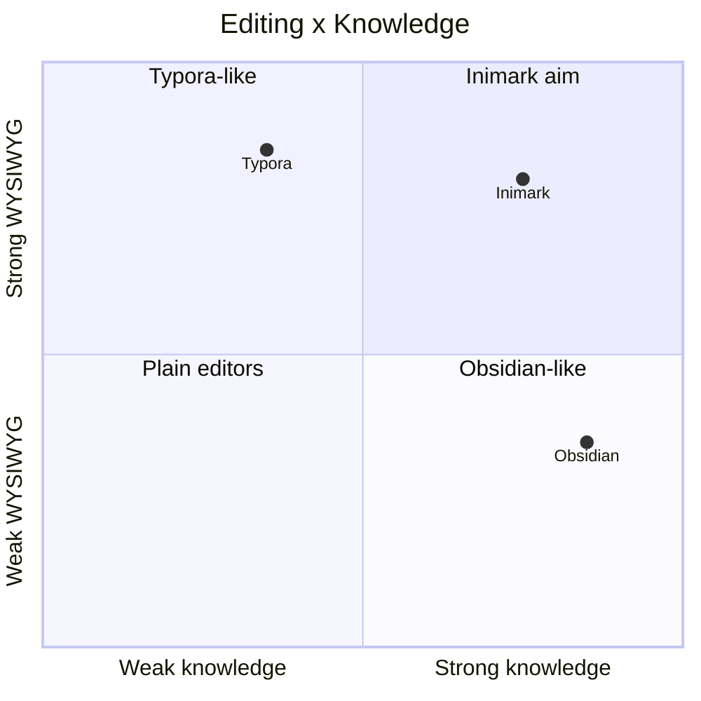

# Feature Comparison

[toc]

**中文:** [[功能对照表|中文]] · [[Roadmap]] · [[Welcome]]

> Goal: set expectations when migrating from Typora / Obsidian. **Not** a scoreboard.

## vs Typora

| Capability | Typora | Inimark |
| --- | --- | --- |
| WYSIWYG | ✅ | ✅ see [[Editing Modes]] |
| Source mode | ✅ | ✅ |
| Typewriter / Focus | ✅ / ✅ | ✅ / 🟡 (Focus API) |
| Outline | ✅ | ✅ [[Search Bookmarks Outline]] |
| Pandoc export suite | ✅ strong | 🟡 Publish/static-first |
| Wikilink vault | ❌ weak | ✅ [[Wikilinks and Embeds]] |
| Graph | ❌ | ✅ [[Relationship Graph]] |
| Multi-root | Open folders | ✅ Libraries |

## vs Obsidian

| Capability | Obsidian | Inimark |
| --- | --- | --- |
| Local vault | ✅ | ✅ [[Libraries and Files]] |
| `[[wikilinks]]` | ✅ | ✅ |
| Graph | ✅ | ✅ |
| Backlinks | ✅ | ✅ (panel lists) |
| Plugin marketplace | ✅ | ❌ |
| Canvas | ✅ | ❌ |
| Daily notes / Templates | ✅ core plugins | ❌ |
| Editing | Source + live preview | **Typora-style WYSIWYG** |
| Publish | Hosted / third-party | ✅ local SSG [[Publish a Site]] |

## Mental map

> [!NOTE]
> If `quadrantChart` fails in your Mermaid build, ignore the diagram — the tables stand alone.

## One-liners

- From **Typora**: familiar writing surface, plus vault + graph.
- From **Obsidian**: familiar links, plus a more typeset writing surface.

Next: [[Roadmap]] · [[Data Directory]]
