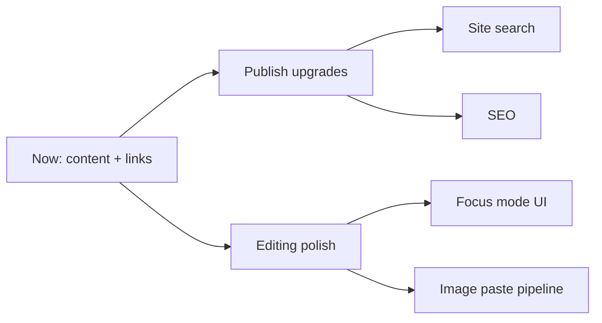

# Roadmap

**中文:** [[路线图|中文]] · [[Feature Comparison]] · [[MOC-English Docs]]

> [!NOTE]
> An honest inventory from **current code**, not a dated commitment. Product priority is yours.

## Already strong

- [x] Typora-style WYSIWYG + source + typewriter
- [x] Rich Markdown: tables, tasks, callouts, TOC, front matter…
- [x] KaTeX · Mermaid
- [x] Libraries · tree · Quick Open · search · bookmarks · outline
- [x] `[[wikilinks]]` / `![[embeds]]` · rewrite · graph
- [x] Theme packs · i18n · settings window · rebindable shortcuts
- [x] Publish SSG + local preview
- [x] Publish multilingual switcher (`locales` + `translationKey`)
- [x] Auto-update pipeline

## Partial / exposed but unfinished

| Item | Status | Docs |
| --- | --- | --- |
| Focus mode | Editor API yes, desktop UI no | [[Editing Modes]] |
| Image storage settings | UI/schema yes, paste pipeline weak | [[Settings Overview]] |
| Footnotes | Marker insert, incomplete render | [[Markdown Syntax]] |
| `#tags` | Theme styles, no pane/parser | [[Wikilinks and Embeds]] |

## Explicitly absent (for now)

- [ ] Plugin system / marketplace
- [ ] Daily Notes · Templates pane
- [ ] Canvas editor
- [ ] Site-wide search (Publish)
- [ ] Cloud sync / collab / mobile

## Publish extension ideas (when needed)

Per your call: **Publish first, then extend**. Candidates:

1. Full-text site search
2. Richer sidebar IA (beyond folder trees)
3. SEO: sitemap / Open Graph
4. Optional vault-wide graph page (per-page local graph already ships)

Back: [[MOC-English Docs]] · Home [[Welcome]]
