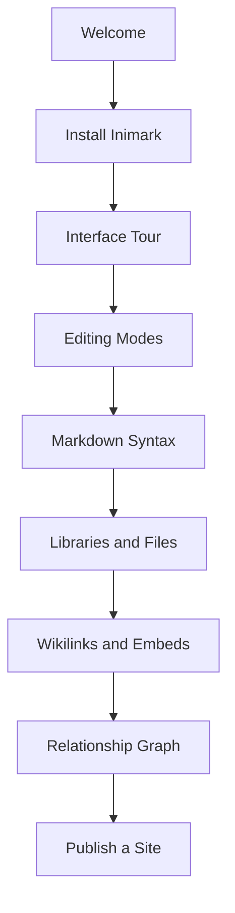

# English Docs · Map of Content

[toc]

> [!NOTE]
> This is the English **MOC**. Topics are wired with `[[wikilinks]]` so the vault reads like a site *and* a graph.

**中文:** [[MOC-中文文档|中文文档]] · Home [[README|Inimark Docs]]

---

## 00 · Getting Started

- [[Welcome]] — positioning and reading path
- [[Install Inimark]] — toolchain and commands
- [[Interface Tour]] — title bar, dual sidebars, status bar

## 01 · Editing and Markdown

- [[Editing Modes]] — WYSIWYG / source / typewriter
- [[Markdown Syntax]] — full format showcase
- [[Math and Diagrams]] — KaTeX · Mermaid
- [[Find Replace and Shortcuts]] — search and keybindings

## 02 · Vault and Knowledge

- [[Libraries and Files]] — libraries · file tree
- [[Wikilinks and Embeds]] — `[[links]]` · `![[embeds]]`
- [[Search Bookmarks Outline]] — Search · Bookmarks · Outline
- [[Relationship Graph]] — local / vault graph

## 03 · Appearance and Publish

- [[Themes and Appearance]] — themes and chrome
- [[Publish a Site]] — Publish / SSG
- [[Settings Overview]] — settings map

## 04 · Appendix

- [[Feature Comparison]] — vs Typora / Obsidian
- [[Data Directory]] — `.inimark/` layout
- [[Roadmap]] — shipped vs planned

---

## Suggested path

- [x] Open this vault
- [x] Start at [[Welcome]]
- [ ] Try [[Publish a Site]] once from Settings
