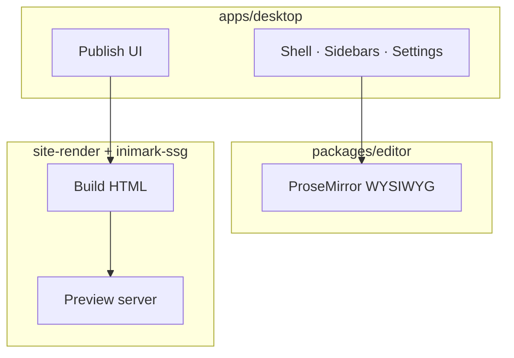

# 安装与启动

**English:** [[Install Inimark|English]] · 返回 [[欢迎]] · [[MOC-中文文档]]

> [!NOTE]
> Inimark 是 **Tauri 2** 桌面应用：前端 Vite + TypeScript，编辑内核在 `@inimark/editor`，原生能力在 Rust。

## 从 GitHub Releases 安装（推荐）

日常使用请从官方发布页下载安装包：

[https://github.com/Dionysen/Inimark/releases](https://github.com/Dionysen/Inimark/releases)

按系统选择对应资源：

| 平台                   | 推荐资源                          |
| -------------------- | ----------------------------- |
| macOS（Apple Silicon） | `.dmg` 或 `.app.tar.gz`        |
| macOS（Intel）         | `.dmg` 或 `.app.tar.gz`        |
| Windows              | `.msi` 或 `.exe`（NSIS）         |
| Linux                | `.AppImage` / `.deb` / `.rpm` |

安装后启动 Inimark，即可打开本地库开始写作。应用内更新会读取同一 Release 中的 `latest.json`。

> [!TIP]
> 优先下载 **Latest** 版本。若浏览器拦截未知来源应用，按系统提示允许打开即可（macOS 可在「隐私与安全性」中确认）。

## 打开本帮助库

1. 启动 Inimark
2. **打开文件夹**，选中仓库中的 `docs/`（或你克隆下来的同一目录）
3. 从 [[欢迎]] 或 [[MOC-中文文档]] 开始阅读
4. 需要时进入设置 → **Publish**，预览站点（见 [[发布为网站]]）

### 检查清单

- [ ] 已从 Releases 安装并可启动
- [ ] 已将 `docs/` 加为库
- [ ] （可选）Publish 预览能打开

## 从源码开发（贡献者）

若要改代码或跑开发版，需要本地工具链：

| 依赖      | 建议版本                           |
| ------- | ------------------------------ |
| Node.js | 20+                            |
| pnpm    | 10+                            |
| Rust    | stable（跑 `pnpm tauri dev` 时需要） |

```bash
pnpm install

# 编辑器单测
pnpm test:editor

# 桌面集成测试
pnpm test:desktop

# 浏览器里开发编辑器
pnpm dev

# Tauri 桌面开发
pnpm tauri dev
```

> [!WARNING]
> 首次 `pnpm tauri dev` 会编译 Rust 依赖，可能较慢。请确保已安装系统平台所需的 [Tauri 前置条件](https://v2.tauri.app/start/prerequisites/)。

## 架构鸟瞰



更多对照见 [[功能对照表]]；磁盘布局见 [[数据目录]]。

---

上一篇：[[欢迎]] · 下一篇：[[界面导览]]