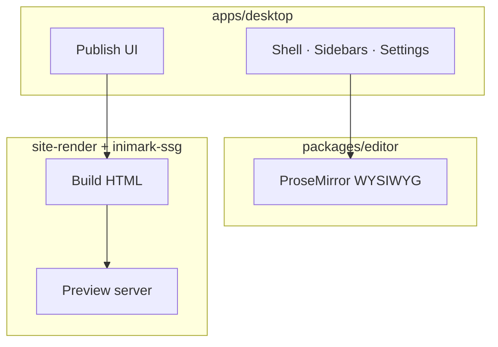

# 安装与启动


**English:** [[Install Inimark|English]] · 返回 [[欢迎]] · [[MOC-中文文档]]

> [!NOTE]
> Inimark 是 **Tauri 2** 桌面应用：前端 Vite + TypeScript，编辑内核在 `@inimark/editor`，原生能力在 Rust。

## 环境要求

| 依赖 | 建议版本 |
| --- | --- |
| Node.js | 20+ |
| pnpm | 10+ |
| Rust | stable（跑 `pnpm tauri dev` 时需要） |

## 常用命令

```bash
pnpm install

# 编辑器单测
pnpm test:editor

# 桌面集成测试
pnpm test:desktop

# 浏览器里开发编辑器
pnpm dev

# Tauri 桌面开发
pnpm tauri dev
```

> [!WARNING]
> 首次 `pnpm tauri dev` 会编译 Rust 依赖，可能较慢。请确保已安装系统平台所需的 [Tauri 前置条件](https://v2.tauri.app/start/prerequisites/)。

## 打开本帮助库

1. 启动 Inimark
2. **打开文件夹**，选中仓库中的 `docs/`
3. 从 [[欢迎]] 或 [[MOC-中文文档]] 开始阅读
4. 需要时进入设置 → **Publish**，预览站点（见 [[发布为网站]]）

### 检查清单

- [ ] Node / pnpm / Rust 已就绪
- [ ] `pnpm install` 成功
- [ ] `pnpm tauri dev` 能启动窗口
- [ ] 已将 `docs/` 加为库

## 架构鸟瞰



更多对照见 [[功能对照表]]；磁盘布局见 [[数据目录]]。

---

上一篇：[[欢迎]] · 下一篇：[[界面导览]]
