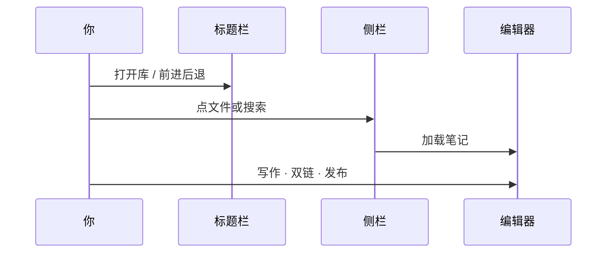

# 界面导览


**English:** [[Interface Tour|English]] · [[MOC-中文文档]]

Inimark 的主界面可以理解为三列：

```text
┌──────────┬─────────────────────┬──────────┐
│ 左侧栏    │     编辑器           │  右侧栏   │
│ Files…   │  WYSIWYG / Source   │ Outline… │
└──────────┴─────────────────────┴──────────┘
               状态栏 / 标题栏
```

## 标题栏

| 区域 | 作用 |
| --- | --- |
| 前进 / 后退 | [[库与文件\|导航历史]]：在打开过的笔记间移动 |
| 窗口控制 | 最小化、最大化、关闭（macOS 使用系统红绿灯） |
| More 菜单 | 沉浸式：自动隐藏标题栏 / 状态栏等 |

> [!TIP]
> 沉浸写作时，可在设置或菜单中开启 **自动隐藏** 标题栏与状态栏，让界面更接近「一张纸」。详见 [[主题与外观]]。

## 双栏侧栏

左右侧栏的 **标签可以自定义布局**（Files / Search / Bookmarks / Outline / Graph）。

| 标签 | 一句话 | 深入阅读 |
| --- | --- | --- |
| Files | 库内文件树 | [[库与文件]] |
| Search | 按名称与内容搜索 | [[搜索书签与大纲]] |
| Bookmarks | 书签与分组 | [[搜索书签与大纲]] |
| Outline | 当前文档标题树 | [[搜索书签与大纲]] |
| Graph | 关系图与出链/回链 | [[关系图谱]] |

侧栏支持：

- **折叠 / 展开**
- **拖拽调整宽度**
- 在设置中调整 **标签左右分配**

## 编辑宿主

中间是 `@inimark/editor`：

- 默认 [[编辑模式#所见即所得|所见即所得]]
- `Ctrl/⌘ + /` 切换 [[编辑模式#源码模式|源码模式]]
- 支持 [[编辑模式#打字机模式|打字机模式]]

右键菜单可插入格式、链接、Callout 等——语法示范见 [[Markdown语法]]。

## 状态栏

常见信息与开关：

- 字数 / 字符统计
- 打字机模式开关
- 滚到顶部 / 底部
- （视配置）其它编辑状态

## 设置窗口

设置是 **独立窗口**，可搜索。分区概览见 [[设置总览]]：

Editor · Appearance · Theme · Shortcuts · Libraries · Publish · Images · Graph · About

---



上一篇：[[安装与启动]] · 下一篇：[[编辑模式]]
