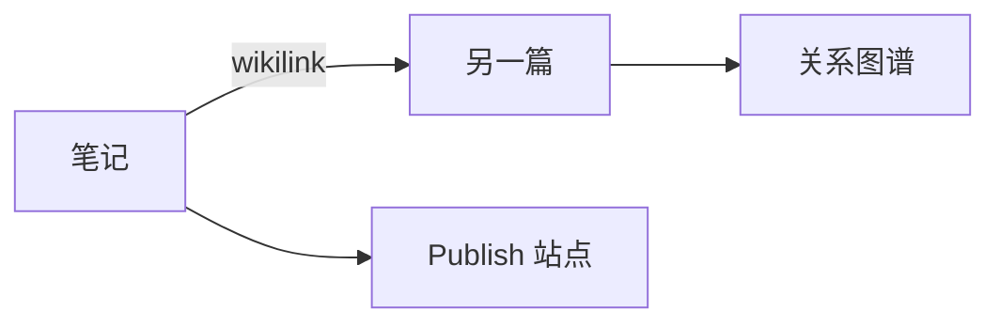
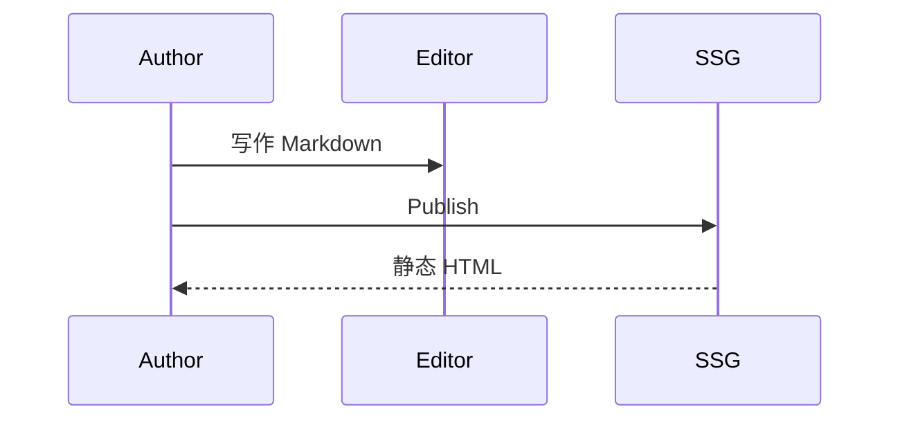
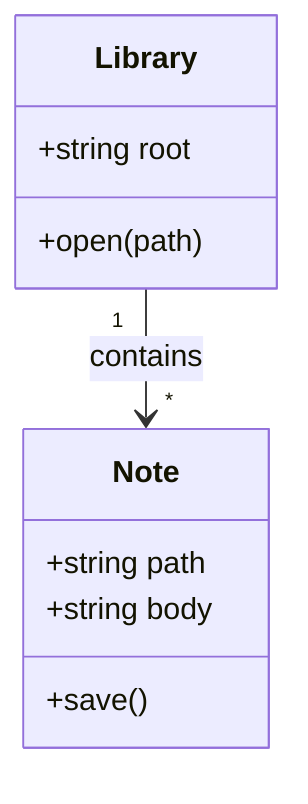
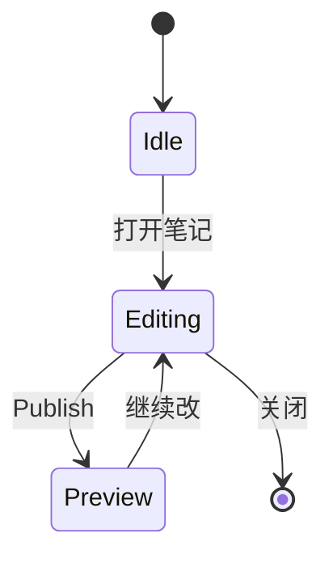
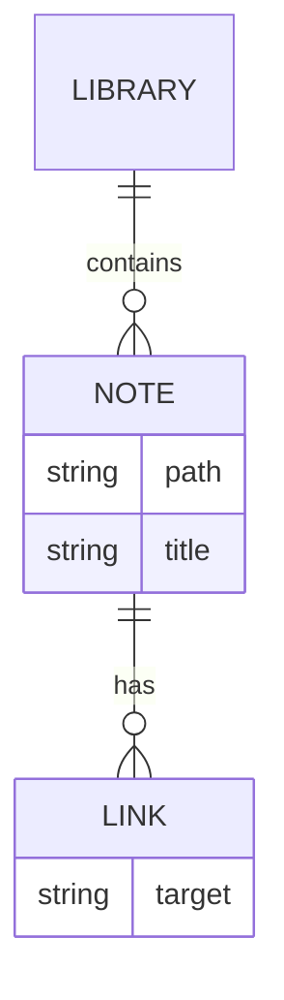
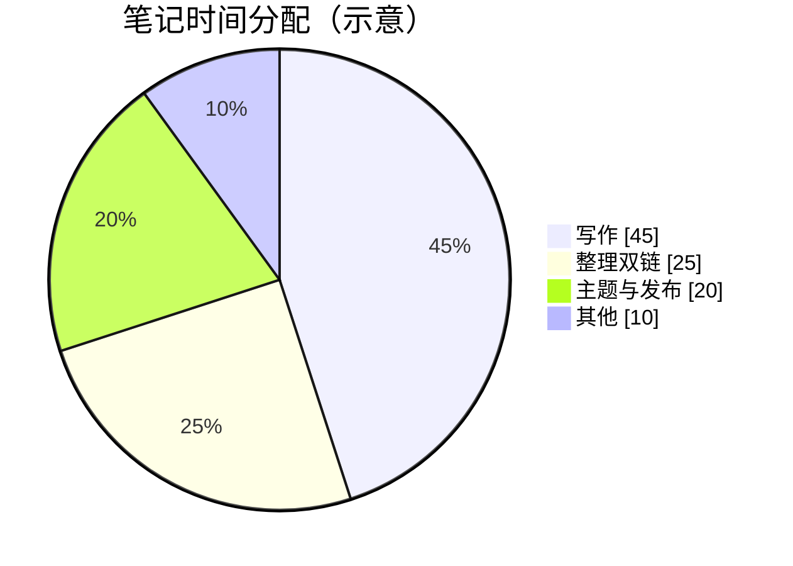
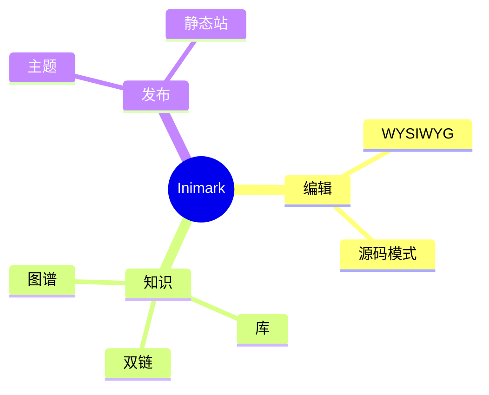
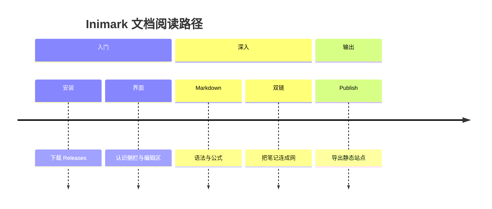
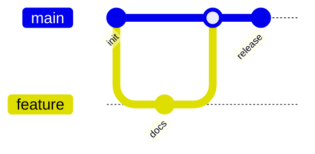

# 数学公式与图表


**English:** [[Math and Diagrams|English]] · [[Markdown语法]] · [[MOC-中文文档]]

Inimark 内置 **KaTeX** 与 **Mermaid**，写法与常见学术 / 技术笔记一致。下方每个示例都是：**先源码，再渲染结果**。

## 行内公式

源码：

```markdown
爱因斯坦质能关系：$E = mc^2$

欧拉公式：$e^{i\pi} + 1 = 0$

勾股定理：$a^2 + b^2 = c^2$
```

渲染：

爱因斯坦质能关系：$E = mc^2$

欧拉公式：$e^{i\pi} + 1 = 0$

勾股定理：$a^2 + b^2 = c^2$

## 块级公式

### 贝叶斯定理

源码：

```markdown
$$
P(A\mid B) = \frac{P(B\mid A)\,P(A)}{P(B)}
$$
```

渲染：

$$
P(A\mid B) = \frac{P(B\mid A)\,P(A)}{P(B)}
$$

### 矩阵乘法

源码：

```markdown
$$
\begin{pmatrix}
a & b \\
c & d
\end{pmatrix}
\begin{pmatrix}
x \\
y
\end{pmatrix}
=
\begin{pmatrix}
ax + by \\
cx + dy
\end{pmatrix}
$$
```

渲染：

$$
\begin{pmatrix}
a & b \\
c & d
\end{pmatrix}
\begin{pmatrix}
x \\
y
\end{pmatrix}
=
\begin{pmatrix}
ax + by \\
cx + dy
\end{pmatrix}
$$

### 高斯积分

源码：

```markdown
$$
\int_{-\infty}^{\infty} e^{-x^{2}}\,dx = \sqrt{\pi}
$$
```

渲染：

$$
\int_{-\infty}^{\infty} e^{-x^{2}}\,dx = \sqrt{\pi}
$$

### 泰勒展开（指数函数）

源码：

```markdown
$$
e^{x} = \sum_{n=0}^{\infty} \frac{x^{n}}{n!} = 1 + x + \frac{x^{2}}{2!} + \frac{x^{3}}{3!} + \cdots
$$
```

渲染：

$$
e^{x} = \sum_{n=0}^{\infty} \frac{x^{n}}{n!} = 1 + x + \frac{x^{2}}{2!} + \frac{x^{3}}{3!} + \cdots
$$

### 傅里叶变换

源码：

```markdown
$$
\hat{f}(\xi) = \int_{-\infty}^{\infty} f(x)\,e^{-2\pi i x\xi}\,dx
$$
```

渲染：

$$
\hat{f}(\xi) = \int_{-\infty}^{\infty} f(x)\,e^{-2\pi i x\xi}\,dx
$$

### 薛定谔方程（含时）

源码：

```markdown
$$
i\hbar\frac{\partial}{\partial t}\Psi(\mathbf{r}, t) = \hat{H}\Psi(\mathbf{r}, t)
$$
```

渲染：

$$
i\hbar\frac{\partial}{\partial t}\Psi(\mathbf{r}, t) = \hat{H}\Psi(\mathbf{r}, t)
$$

### 麦克斯韦方程组

源码：

```markdown
$$
\begin{aligned}
\nabla\cdot\mathbf{E} &= \frac{\rho}{\varepsilon_{0}} \\
\nabla\cdot\mathbf{B} &= 0 \\
\nabla\times\mathbf{E} &= -\frac{\partial\mathbf{B}}{\partial t} \\
\nabla\times\mathbf{B} &= \mu_{0}\mathbf{J} + \mu_{0}\varepsilon_{0}\frac{\partial\mathbf{E}}{\partial t}
\end{aligned}
$$
```

渲染：

$$
\begin{aligned}
\nabla\cdot\mathbf{E} &= \frac{\rho}{\varepsilon_{0}} \\
\nabla\cdot\mathbf{B} &= 0 \\
\nabla\times\mathbf{E} &= -\frac{\partial\mathbf{B}}{\partial t} \\
\nabla\times\mathbf{B} &= \mu_{0}\mathbf{J} + \mu_{0}\varepsilon_{0}\frac{\partial\mathbf{E}}{\partial t}
\end{aligned}
$$

### 拉格朗日方程

源码：

```markdown
$$
\frac{d}{dt}\left(\frac{\partial L}{\partial \dot{q}_{i}}\right) - \frac{\partial L}{\partial q_{i}} = 0
$$
```

渲染：

$$
\frac{d}{dt}\left(\frac{\partial L}{\partial \dot{q}_{i}}\right) - \frac{\partial L}{\partial q_{i}} = 0
$$

### 爱因斯坦场方程

源码：

```markdown
$$
R_{\mu\nu} - \frac{1}{2}Rg_{\mu\nu} + \Lambda g_{\mu\nu} = \frac{8\pi G}{c^{4}}T_{\mu\nu}
$$
```

渲染：

$$
R_{\mu\nu} - \frac{1}{2}Rg_{\mu\nu} + \Lambda g_{\mu\nu} = \frac{8\pi G}{c^{4}}T_{\mu\nu}
$$

### 纳维–斯托克斯方程（不可压）

源码：

```markdown
$$
\rho\left(\frac{\partial\mathbf{u}}{\partial t} + \mathbf{u}\cdot\nabla\mathbf{u}\right) = -\nabla p + \mu\nabla^{2}\mathbf{u} + \mathbf{f}
$$
```

渲染：

$$
\rho\left(\frac{\partial\mathbf{u}}{\partial t} + \mathbf{u}\cdot\nabla\mathbf{u}\right) = -\nabla p + \mu\nabla^{2}\mathbf{u} + \mathbf{f}
$$

### 柯西积分公式

源码：

```markdown
$$
f(a) = \frac{1}{2\pi i}\oint_{C}\frac{f(z)}{z-a}\,dz
$$
```

渲染：

$$
f(a) = \frac{1}{2\pi i}\oint_{C}\frac{f(z)}{z-a}\,dz
$$

### 布莱克–斯科尔斯 PDE

源码：

```markdown
$$
\frac{\partial V}{\partial t} + \frac{1}{2}\sigma^{2}S^{2}\frac{\partial^{2}V}{\partial S^{2}} + rS\frac{\partial V}{\partial S} - rV = 0
$$
```

渲染：

$$
\frac{\partial V}{\partial t} + \frac{1}{2}\sigma^{2}S^{2}\frac{\partial^{2}V}{\partial S^{2}} + rS\frac{\partial V}{\partial S} - rV = 0
$$

> [!TIP]
> 大段公式建议在 [[编辑模式#源码模式|源码模式]] 里微调，再切回 WYSIWYG 查看。

## Mermaid 图表示例

每个图种先给出可复制的源码，再给出渲染结果。源码写在 ` ```mermaid ` 代码块中即可。

### 流程图（flowchart）

源码：

````markdown

````

渲染：


### 时序图（sequenceDiagram）

源码：

````markdown

````

渲染：


### 类图（classDiagram）

源码：

````markdown

````

渲染：


### 状态图（stateDiagram）

源码：

````markdown

````

渲染：


### 实体关系图（erDiagram）

源码：

````markdown

````

渲染：


### 甘特图（gantt）

源码：

````markdown

````

渲染：


### 饼图（pie）

源码：

````markdown

````

渲染：


### 脑图（mindmap）

源码：

````markdown

````

渲染：


### 时间线（timeline）

源码：

````markdown

````

渲染：


### Git 图（gitGraph）

源码：

````markdown

````

渲染：


### 旅程图（journey）

源码：

````markdown
```mermaid
journey
  title 从安装到发布
  section 安装
    打开 Releases: 5: 用户
    安装应用: 4: 用户
  section 写作
    打开 docs 库: 5: 用户
    编辑笔记: 5: 用户
  section 发布
    Publish 预览: 4: 用户
```
````

渲染：

```mermaid
journey
  title 从安装到发布
  section 安装
    打开 Releases: 5: 用户
    安装应用: 4: 用户
  section 写作
    打开 docs 库: 5: 用户
    编辑笔记: 5: 用户
  section 发布
    Publish 预览: 4: 用户
```

### 象限图（quadrantChart）

源码：

````markdown
```mermaid
quadrantChart
  title 功能取舍（示意）
  x-axis 低投入 --> 高投入
  y-axis 低价值 --> 高价值
  quadrant-1 优先做
  quadrant-2 评估后做
  quadrant-3 少做
  quadrant-4 谨慎
  WYSIWYG: [0.7, 0.85]
  双链图谱: [0.65, 0.8]
  Publish: [0.55, 0.75]
  插件市场: [0.9, 0.35]
```
````

渲染：

```mermaid
quadrantChart
  title 功能取舍（示意）
  x-axis 低投入 --> 高投入
  y-axis 低价值 --> 高价值
  quadrant-1 优先做
  quadrant-2 评估后做
  quadrant-3 少做
  quadrant-4 谨慎
  WYSIWYG: [0.7, 0.85]
  双链图谱: [0.65, 0.8]
  Publish: [0.55, 0.75]
  插件市场: [0.9, 0.35]
```

### 需求图（requirementDiagram）

源码：

````markdown
```mermaid
requirementDiagram
  requirement stable {
    id: R1
    text: 公式与图表在 WYSIWYG 中可渲染
    risk: low
    verifymethod: test
  }
  element editor {
    type: component
  }
  editor - satisfies -> stable
```
````

渲染：

```mermaid
requirementDiagram
  requirement stable {
    id: R1
    text: 公式与图表在 WYSIWYG 中可渲染
    risk: low
    verifymethod: test
  }
  element editor {
    type: component
  }
  editor - satisfies -> stable
```

> [!NOTE]
> 部分较新的 Mermaid 图种（如 `sankey`、`xychart`、`block`）取决于内置 Mermaid 版本。上表所列均为常用、稳定类型。

## 与发布的关系

Publish 会打包 KaTeX 资源，使站点中的公式尽可能保持一致。主题与站点配置见 [[发布为网站]]、[[主题与外观]]。

---

上一篇：[[Markdown语法]] · 下一篇：[[查找替换与快捷键]]
