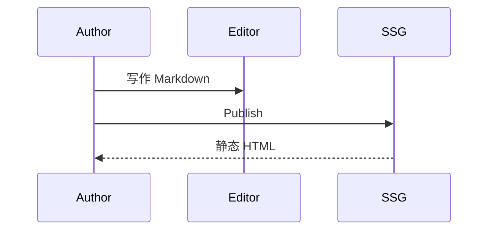
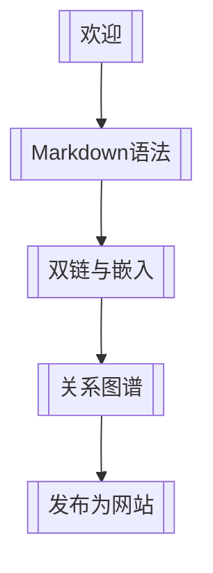

# 数学公式与图表


**English:** [[Math and Diagrams|English]] · [[Markdown语法]] · [[MOC-中文文档]]

Inimark 内置 **KaTeX** 与 **Mermaid**，写法与常见学术 / 技术笔记一致。

## 行内公式

爱因斯坦质能关系：$E = mc^2$

勾股定理：$a^2 + b^2 = c^2$

写法：

```markdown
$E = mc^2$
```

## 块级公式

贝叶斯定理：

$$
P(A\mid B) = \frac{P(B\mid A)\,P(A)}{P(B)}
$$

矩阵示例：

$$
\begin{pmatrix}
a & b \\
c & d
\end{pmatrix}
\begin{pmatrix}
x \\
y
\end{pmatrix}
=
\begin{pmatrix}
ax + by \\
cx + dy
\end{pmatrix}
$$

> [!TIP]
> 大段公式建议在 [[编辑模式#源码模式|源码模式]] 里微调，再切回 WYSIWYG 查看。

## Mermaid 流程图

```mermaid
flowchart LR
  Note[笔记] -->|[[wikilink]]| Note2[另一篇]
  Note2 --> Graph[关系图谱]
  Note --> Site[Publish 站点]
```

## Mermaid 时序图



## Mermaid 状态 / 脑图

知识库阅读路径（示意）：



> [!NOTE]
> 其它 Mermaid 图种能否渲染，取决于内置 Mermaid 版本与安全配置。优先使用 `flowchart` / `sequenceDiagram` 等常见类型。

## 与发布的关系

Publish 会打包 KaTeX 资源，使站点中的公式尽可能保持一致。主题与站点配置见 [[发布为网站]]、[[主题与外观]]。

---

上一篇：[[Markdown语法]] · 下一篇：[[查找替换与快捷键]]
