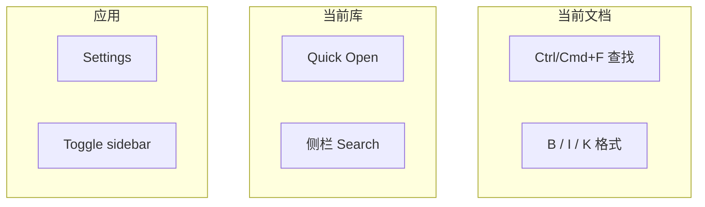

# 查找替换与快捷键

**English:** [[Find Replace and Shortcuts|English]] · [[编辑模式]] · [[设置总览]]

## 查找与替换

| 操作 | 默认（Windows / Linux） | macOS |
| --- | --- | --- |
| 查找 | `Ctrl + F` | `⌘ + F` |
| 替换 | `Ctrl + H` | `⌘ + H` |

查找栏支持：

- [x] 区分大小写
- [x] 全词匹配
- [x] 正则表达式

> [!TIP]
> 库级搜索（跨文件）在侧栏 **Search**，见 [[搜索书签与大纲]]。`Ctrl+F` 是 **当前文档** 内查找。

## 编辑器常用快捷键

| 动作 | Windows / Linux | macOS |
| --- | --- | --- |
| 加粗 | `Ctrl + B` | `⌘ + B` |
| 斜体 | `Ctrl + I` | `⌘ + I` |
| 下划线 | `Ctrl + U` | `⌘ + U` |
| 链接 | `Ctrl + K` | `⌘ + K` |
| 标题 1–6 | `Ctrl + 1…6` | `⌘ + 1…6` |
| 正文 | `Ctrl + 0` | `⌘ + 0` |
| 源码模式 | `Ctrl + /` | `⌘ + /` |
| 纯文本粘贴 | `Ctrl + Shift + V` | `⌘ + Shift + V` |
| 硬换行 | `Shift + Enter` | `Shift + Enter` |

列表、引用、代码、公式等还有 `Alt + Ctrl/⌘ + …` 组合——以 **设置 → Shortcuts** 与编辑器默认为准。

## 应用级快捷键（可重绑）

在 **Settings → Shortcuts** 可改：

| 类别 | 例子 |
| --- | --- |
| File | 保存、另存为、新建、关闭 |
| Open | 快速打开（默认常映射为 Open） |
| View | 切换侧栏、库内搜索 |
| Explorer | 重命名、删除、剪切复制粘贴 |
| App | 打开设置 |

> [!NOTE]
> 「打开」在 Inimark 里常常是 **Quick Open**（模糊找笔记），而不是系统文件对话框。详见 [[库与文件]]。

## 字体缩放

`Ctrl/⌘ + 滚轮` 可缩放编辑区字体——长文阅读时很有用。

## 键位心智模型

想改键位 → [[设置总览]]；想学格式 → [[Markdown语法]]。
