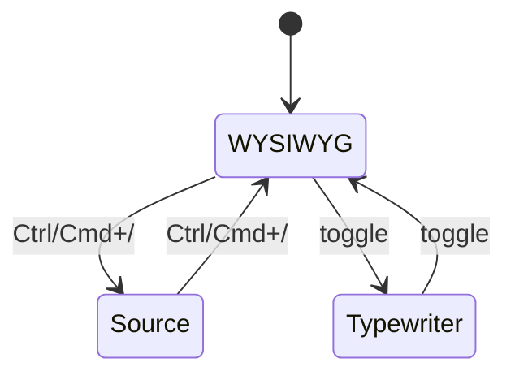

# 编辑模式

[toc]

**English:** [[Editing Modes|English]] · 目录 [[MOC-中文文档]]

Inimark 的编辑哲学很简单：

> **一张表面，两种深度** —— 默认像阅读排好版的文章；需要时露出 Markdown 源码。

## 所见即所得

这是默认模式（Typora 风格）：

- 光标所在行 / 片段会显示语法标记（`**`、`#`、`[[`…）
- 光标离开后，标记隐藏，只剩排版结果
- **没有**左右分屏的「实时预览」——预览就是编辑面本身

> [!TIP]
> 若你从传统「左 MD 右 HTML」编辑器迁移，先花一天只使用 WYSIWYG；多数人会更快进入心流。对照见 [[功能对照表]]。

示例（写的时候是源码，读的时候是效果）：

> 这是一段 **强调** 与 ==高亮== 并存的引用。
>
> 也可以变成 Callout：

> [!NOTE]
> Callout 属于扩展语法，完整列表在 [[Markdown语法#Callout 提示块|Markdown语法]]。

## 源码模式

快捷键：`Ctrl + /`（macOS：`⌘ + /`）

| 特性 | 说明 |
| --- | --- |
| 引擎 | CodeMirror |
| 行号 | 支持 |
| 用途 | 大段结构调整、粘贴复杂源码、排查语法 |

切换回 WYSIWYG 后，文档会重新折叠为排版视图。

## 打字机模式

让 **当前行垂直居中**（或接近居中），减少颈部上下扫视——适合长文。

- 可在 **设置 → Editor** 开启
- 也可从 **状态栏** 切换（见 [[界面导览]]）

## 专注模式（能力已有，UI 待接）

编辑内核已提供 Focus Mode API（淡化非当前块），桌面壳层 **尚未挂快捷键 / 设置项**。

> [!WARNING]
> 文档只描述 **已接线** 的能力。专注模式请看 [[路线图]]，避免以为设置里一定找得到开关。

## 模式对照

| 模式 | 成熟度 | 入口 |
| --- | --- | --- |
| WYSIWYG | ✅ | 默认 |
| Source | ✅ | `Ctrl/⌘+/` |
| Typewriter | ✅ | 设置 / 状态栏 |
| Focus | 🟡 API | 见 [[路线图]] |

相关：[[Markdown语法]] · [[查找替换与快捷键]] · [[数学公式与图表]]
