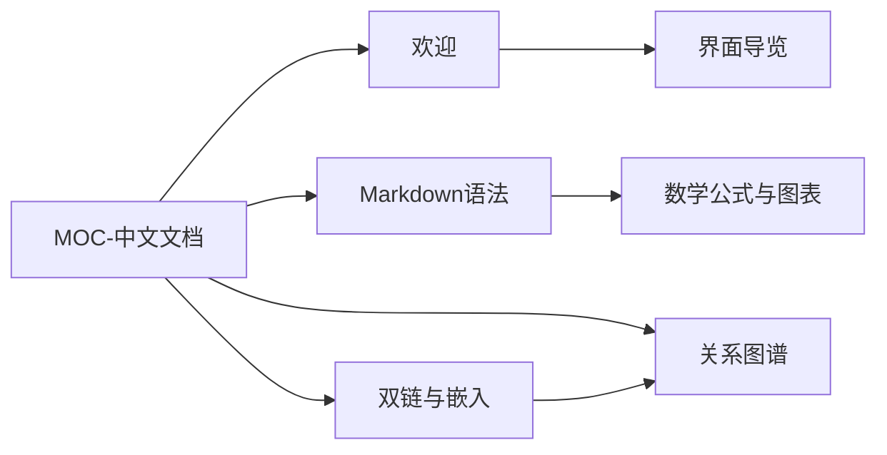

# 关系图谱

**English:** [[Relationship Graph|English]] · [[双链与嵌入]] · [[MOC-中文文档]]

图谱把 `[[双链]]` 变成可漫游的空间——节点是笔记，边是链接。

## 视图

| 模式 | 含义 |
| --- | --- |
| 局部 | 以当前笔记为中心的邻域 |
| 全局 / 库 | 更广的库级关系 |

力导向布局会自动散开节点，减少重叠。

## 面板能力（概览）

- 出链 / 回链 **列表**
- 适配窗口（fit）
- 时序 / 漫游类交互（以实机 Graph 面板为准）
- 可与编辑器联动（选中节点打开笔记）

> [!TIP]
> 先把帮助库的双链写稠：从 [[MOC-中文文档]] 链到各章，再打开 Graph，会立刻看到「文档站」在空间中的形状。

## 本帮助库的示意结构

## 设置

**Settings → Graph** 可调图谱相关偏好（具体项以版本为准）。

## 边界

| 有 | 无（目前） |
| --- | --- |
| 笔记关系图 | 标签图 |
| 出链 / 回链 | Canvas 白板编辑器 |
| 力导向 | Dataview 式查询 |

见 [[路线图]]、[[功能对照表]]。

---

上一篇：[[搜索书签与大纲]] · 下一篇：[[主题与外观]]
