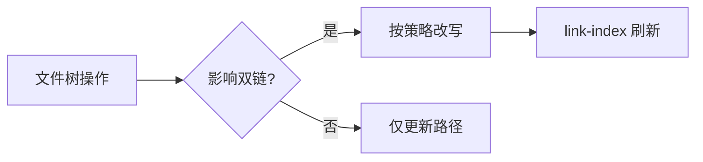

# 库与文件

[toc]

**English:** [[Libraries and Files|English]] · [[双链与嵌入]] · [[MOC-中文文档]]

## 什么是库（Library）

库 ≈ Obsidian 的 Vault：一个 **本地文件夹**，里面是你的 Markdown（与资源）。

Inimark 支持 **多库切换**（Settings → Libraries）。

> [!IMPORTANT]
> 本帮助站点的源就是仓库里的 `docs/` 文件夹——把它当作一个库打开即可。

## 文件树（Files）

在侧栏 Files 中你可以：

| 操作 | 说明 |
| --- | --- |
| 新建 | 笔记 / 文件夹 |
| 重命名 | 触发改链策略（见下） |
| 删除 | 需确认 |
| 移动 | 拖拽或剪切粘贴 |
| 定位 | 在树中揭示当前文件 |
| 排序 | 按名称等规则 |

支持 **拖拽** 整理结构。

## 快速打开（Quick Open）

模糊匹配文件名 + 最近打开记录——日常跳转的主力。

典型默认键位常绑定在「打开」上（可在 Shortcuts 修改）→ [[查找替换与快捷键]]。

## 导航历史

标题栏 **后退 / 前进** 在浏览过的笔记间移动，类似浏览器，见 [[界面导览]]。

## 会话记忆

每个库会记住部分视图状态（光标、滚动、是否源码模式等），存在 `.inimark/session.json` 一类文件中——详见 [[数据目录]]。

## 重命名与移动

当你重命名或移动被双链引用的笔记时，Inimark 可按设置：

| 策略 | 行为 |
| --- | --- |
| ask | 每次询问是否改写链接 |
| always | 总是改写 |
| never | 不改写 |

机制说明见 [[双链与嵌入#重命名与改链]]。

下一步：用双链把文件连成网 → [[双链与嵌入]]。
