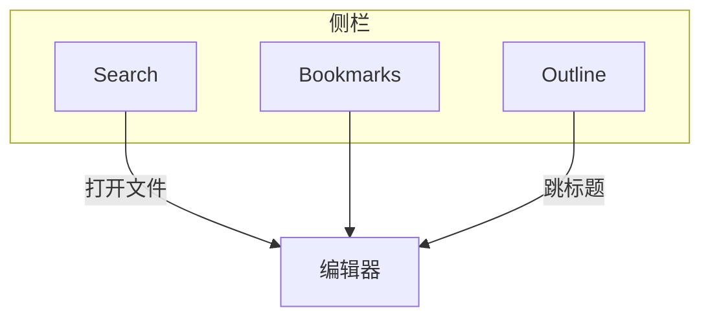

# 搜索、书签与大纲

**English:** [[Search Bookmarks Outline|English]] · [[界面导览]] · [[库与文件]]

侧栏三个「导航型」标签，和 [[关系图谱]] 互补。

## Search · 库内搜索

| 能力 | 说明 |
| --- | --- |
| 文件名 | 快速筛笔记 |
| 内容 | 全文命中 |
| 跳转 | 打开文件并可配合编辑器内高亮/揭示 |

> [!NOTE]
> 这与文档内 `Ctrl+F` 不同：Search = **跨文件**；Find = **当前文件**。见 [[查找替换与快捷键]]。

## Bookmarks · 书签

把常用笔记钉起来，并可用 **分组** 整理。

当前书签模型以 **文件** 为主（文件夹书签已收敛掉）。

典型用途：

- 写作中的「本周主线」
- 帮助库里的 [[MOC-中文文档]]
- 发布前的校对清单笔记

- [ ] 把 [[发布为网站]] 加书签
- [ ] 把 [[Markdown语法]] 加书签

## Outline · 大纲

根据当前笔记的 AT 标题生成树，点击跳转。

适合：

- 长文结构导航
- 长文结构导航（侧栏常驻，无需离开当前视图）

标签左右布局可在设置里调整 → [[设置总览]] · [[界面导览]]。

---

下一篇：[[关系图谱]]
