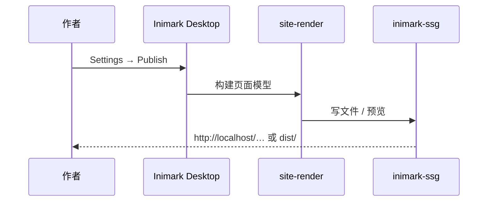

# 发布为网站

[toc]

**English:** [[Publish a Site|English]] · [[主题与外观]] · [[MOC-中文文档]]

把当前库 **构建为静态站点**：同一套 Markdown、同一套主题语言、文件夹树即导航。

> [!IMPORTANT]
> 本 `docs/` 帮助库就是为 Publish 准备的。配置文件：`publish.config.json`。

## 你将得到什么

| 能力 | 状态 |
| --- | --- |
| 多页 HTML | ✅ |
| 文件夹导航树 | ✅ |
| 页内大纲 | ✅ |
| 主题切换 | ✅ |
| `[[wikilinks]]` → 相对链接 | ✅ |
| 本地预览服务器 | ✅ |
| 站点全文搜索 | ❌（后续可扩展） |
| 图谱页 | ❌（后续可扩展） |

诚实边界也写在 [[路线图]]。

## 配置项

| 字段 | 含义 | 本库示例 |
| --- | --- | --- |
| `siteName` | 站点名 | `Inimark Docs` |
| `siteDescription` | 描述（meta） | 见配置文件 |
| `defaultTheme` | 默认主题 | `light` |
| `baseHref` | 部署前缀 | `/` 或 `/repo/` |
| `out` | 输出目录 | `dist` |
| `home` | 首页笔记 | `README.md` |

## 操作步骤

1. 用 Inimark 打开 `docs/` 为库
2. 打开 **Settings → Publish**
3. 确认 `siteName` / `out` / `baseHref` / `home`
4. **Preview** 本地预览，或构建输出
5. 将 `dist/` 部署到任意静态托管

## 写作约定（让站点更好读）

- 用 **文件夹编号** 控制导航顺序（`00-` `01-`…）
- 每个主题 **唯一标题**，方便 `[[双链]]`
- 中英平行树：`zh/` 与 `en/`，用别名互链
- 善用 `[toc]`、Callout、表格 —— 见 [[Markdown语法]]
- 首页用 [[README]] 做语言门户

## 以后如何扩展 Publish

当你需要搜索、SEO、版本切换时，可以：

1. **增强 Inimark Publish**（产品 dogfood），或
2. 把同一批 Markdown **同步到独立文档站**

现阶段策略：**先用 Publish**，有需求再扩展能力——与产品决策一致。

---

相关：[[设置总览]] · [[数据目录]] · [[功能对照表]]
