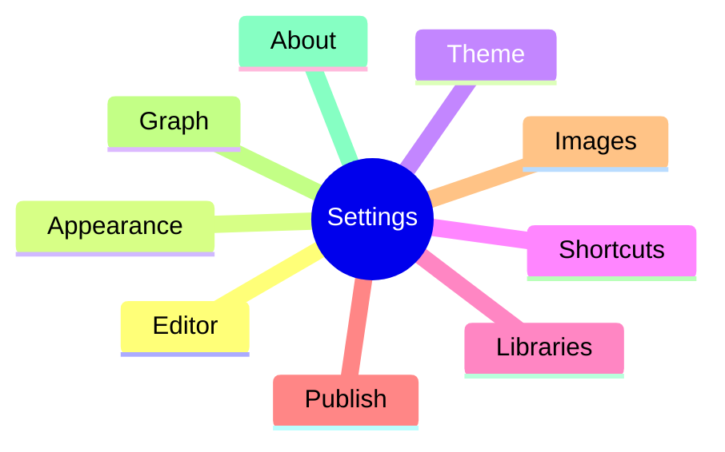

# 设置总览

**English:** [[Settings Overview|English]] · [[界面导览]] · [[查找替换与快捷键]]

设置窗口可 **搜索**；以下是分区速查。

| 分区 | 你会调什么 | 相关文档 |
| --- | --- | --- |
| Editor | 打字机、自动保存、Markdown 保存时格式化… | [[编辑模式]] |
| Appearance | 明暗、沉浸式 chrome | [[主题与外观]] |
| Theme | 主题包导入导出、代码主题 | [[主题与外观]] |
| Shortcuts | 重绑快捷键 | [[查找替换与快捷键]] |
| Libraries | 多库、链接改写策略 | [[库与文件]] · [[双链与嵌入]] |
| Publish | 站点名、输出、预览 | [[发布为网站]] |
| Images | 存储模式 / 资源目录（部分能力仍在完善） | [[路线图]] |
| Graph | 图谱偏好 | [[关系图谱]] |
| About | 版本、检查更新 | — |
| Dev | 开发者工具（非日常用户功能） | — |

> [!WARNING]
> **Images** 分区的 UI 可能超前于完整粘贴落盘管线。以实机行为为准，缺口见 [[路线图]]。

## 自动保存与格式化

- 自动保存：可配置延迟
- 保存时格式化：CJK 空格、裁剪空白、文件末换行、压缩多余空行等

这些选项让长期库更干净，也利于 [[发布为网站]] 的输出稳定。

## i18n

应用 UI 支持 `en` / `zh-CN`（可跟随系统）。**帮助文档** 本身是中英平行笔记树，与 UI 语言独立——见 [[README]]。

