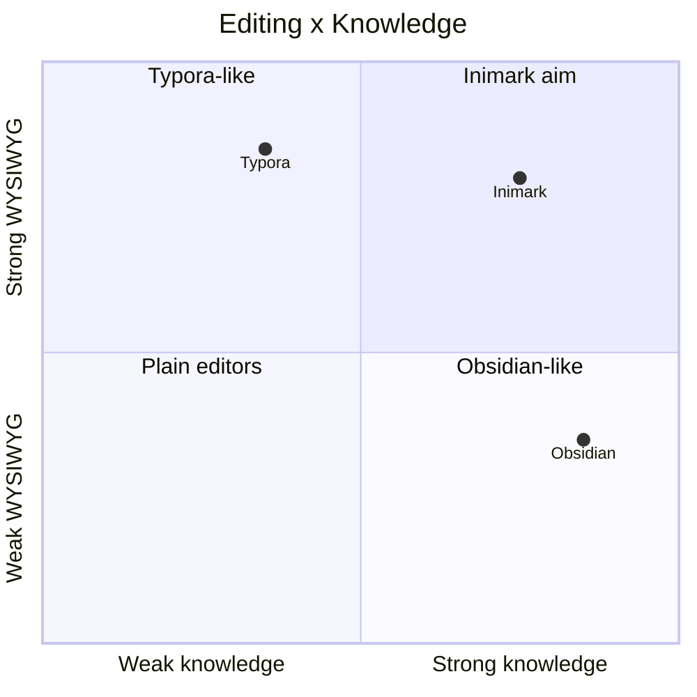

# 功能对照表

**English:** [[Feature Comparison|English]] · [[路线图]] · [[欢迎]]

> 对照目的：降低从 Typora / Obsidian 迁入的预期差。**不是**功能竞赛榜。

## vs Typora

| 能力 | Typora | Inimark |
| --- | --- | --- |
| WYSIWYG | ✅ | ✅ 见 [[编辑模式]] |
| 源码模式 | ✅ | ✅ |
| 打字机 / 专注 | ✅ / ✅ | ✅ / 🟡（Focus API） |
| 大纲 | ✅ | ✅ [[搜索书签与大纲]] |
| 导出 Pandoc 全家桶 | ✅ 强 | 🟡 以 Publish/静态为主 |
| 双链知识库 | ❌ 弱 | ✅ [[双链与嵌入]] |
| 关系图谱 | ❌ | ✅ [[关系图谱]] |
| 多库 | 文件夹打开 | ✅ Libraries |

## vs Obsidian

| 能力 | Obsidian | Inimark |
| --- | --- | --- |
| 本地库 | ✅ | ✅ [[库与文件]] |
| `[[wikilinks]]` | ✅ | ✅ |
| Graph | ✅ | ✅ |
| 反向链接 | ✅ | ✅（面板列表） |
| 插件市场 | ✅ | ❌ |
| Canvas | ✅ | ❌ |
| Daily notes / Templates | ✅ 核心插件 | ❌ |
| 编辑体验 | 源码+实时预览为主 | **Typora 式 WYSIWYG** |
| Publish | 官方服务 / 第三方 | ✅ 本地 SSG [[发布为网站]] |

## 心智图

> [!NOTE]
> 若 Mermaid `quadrantChart` 在你的版本无法渲染，忽略图即可——表格已足够。

## 一句话

- 来自 **Typora**：你会感到编辑面熟悉，并多出库与图谱。
- 来自 **Obsidian**：你会感到链接熟悉，并多出更「排版化」的写作面。

继续：[[路线图]] · [[数据目录]]
