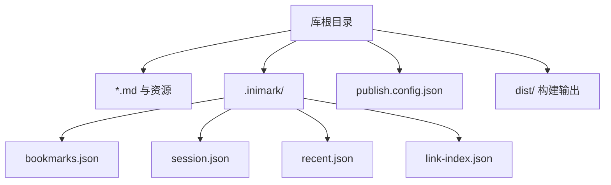

# 数据目录

**English:** [[Data Directory|English]] · [[库与文件]] · [[发布为网站]]

## 应用级（大致）

| 存储 | 内容 |
| --- | --- |
| `localStorage` | 应用设置、快捷键、库列表等 |

> 具体 key 以版本为准；不要用手动改存储代替设置 UI。

## 库级：`.inimark/`

每个库根目录下：

| 文件 | 作用 |
| --- | --- |
| `bookmarks.json` | 书签与分组 |
| `session.json` | 会话：打开文件、光标/滚动、源码模式等 |
| `recent.json` | 最近文件 |
| `link-index.json` | 双链索引缓存 |

> [!DANGER]
> `link-index.json` 可被应用重建。**不要**把它当手写数据库长期编辑。

## 本帮助库额外文件

| 路径 | 说明 |
| --- | --- |
| `publish.config.json` | Publish 配置（含可选 `locales`） |
| `README.md` | 双语门户首页 |
| `zh/` · `en/` | 平行文档树 |
| `dist/` | 构建产物（通常被全局 `dist/` ignore） |

相关：[[发布为网站]] · [[双链与嵌入]]
