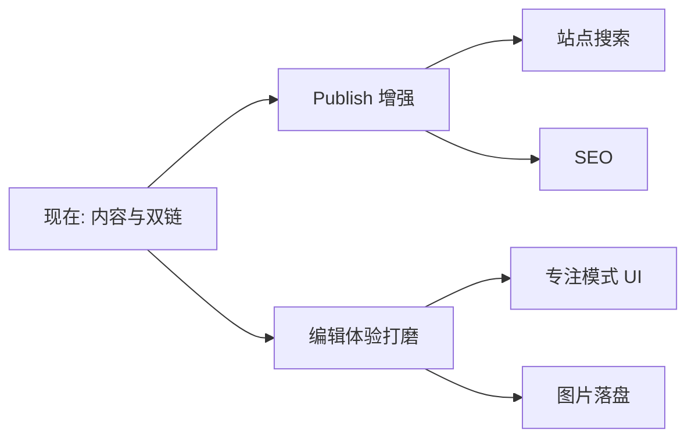

# 路线图

**English:** [[Roadmap|English]] · [[功能对照表]] · [[MOC-中文文档]]

> [!NOTE]
> 这是基于 **当前代码盘点** 的诚实清单，不是承诺排期。产品优先级以你的决策为准。

## 已经很好用

- [x] Typora 式 WYSIWYG + 源码模式 + 打字机
- [x] 丰富 Markdown：表格、任务、Callout、TOC、Front matter…
- [x] KaTeX · Mermaid
- [x] Libraries · 文件树 · Quick Open · 搜索 · 书签 · 大纲
- [x] `[[wikilinks]]` / `![[embeds]]` · 改链 · 图谱
- [x] 主题包 · i18n · 设置窗 · 快捷键重绑
- [x] Publish SSG + 本地预览
- [x] 自动更新管线

## 部分完成 / 已暴露但未完成

| 项 | 现状 | 文档 |
| --- | --- | --- |
| 专注模式 | 编辑器 API 有，桌面未接线 | [[编辑模式]] |
| 图片存储设置 | UI/schema 有，落盘管线弱 | [[设置总览]] |
| 脚注 | 可插入标记，渲染不完整 | [[Markdown语法]] |
| `#tag` | 主题样式有，解析/面板无 | [[双链与嵌入]] |

## 明确没有（暂）

- [ ] 插件系统 / 市场
- [ ] Daily Notes · Templates 面板
- [ ] Canvas 编辑器
- [ ] 站点内全文搜索（Publish）
- [ ] 云同步 / 协作编辑 / 移动端

## Publish 扩展方向（当你需要时）

按你的选择：**先 Publish，再增强**。候选：

1. 站点全文搜索
2. 更好的侧栏 IA（不只是文件夹树）
3. SEO：sitemap / Open Graph
4. 多语言切换控件（现在靠笔记互链）
5. 可选嵌入图谱页

回到导航：[[MOC-中文文档]] · 首页 [[README]]
