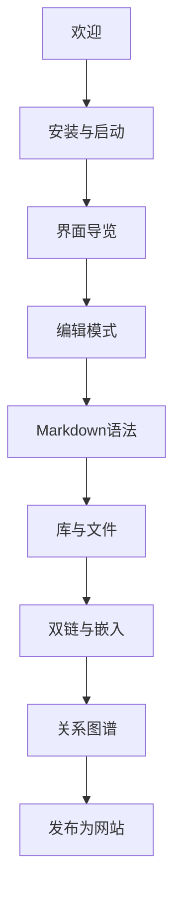

# 中文文档 · 内容地图

> [!NOTE]
> 这是中文帮助的 **MOC（Map of Content）**。每个主题都用双链串起来——像 Obsidian，读起来像一本站。

**English:** [[MOC-English Docs|English Docs]] · 首页 [[README|Inimark Docs]]

---

## 00 · 由此开始

- [[欢迎]] — 产品定位与阅读路径
- [[安装与启动]] — 环境与命令
- [[界面导览]] — 标题栏、双栏、状态栏

## 01 · 编辑与 Markdown

- [[编辑模式]] — WYSIWYG / 源码 / 打字机
- [[Markdown语法]] — 格式全家桶（本库示范）
- [[数学公式与图表]] — KaTeX · Mermaid
- [[查找替换与快捷键]] — 搜索与键位

## 02 · 库与知识网络

- [[库与文件]] — Libraries · 文件树
- [[双链与嵌入]] — `[[链接]]` · `![[嵌入]]`
- [[搜索书签与大纲]] — Search · Bookmarks · Outline
- [[关系图谱]] — Graph 局部 / 全局

## 03 · 外观与发布

- [[主题与外观]] — 明暗与主题包
- [[发布为网站]] — Publish / SSG
- [[设置总览]] — 设置分区速查

## 04 · 附录

- [[功能对照表]] — vs Typora / Obsidian
- [[数据目录]] — `.inimark/` 说明
- [[路线图]] — 已实现与待补齐

---

## 推荐阅读顺序

- [x] 打开本库
- [x] 从 [[欢迎]] 开始
- [ ] 在设置里试一次 [[发布为网站]]
